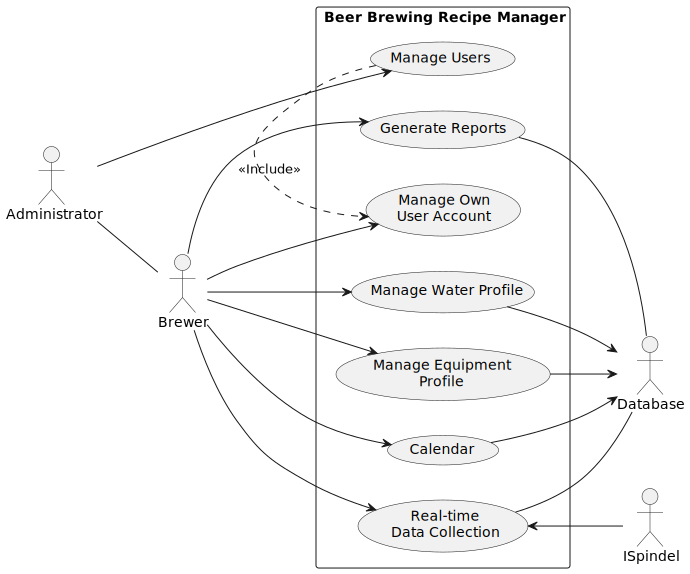

# Use-cases

## Beer Brewing Recipe Manager Overview

The Beer Brewing Recipe Manager conceptualizes a system to simplify the management of brewing processes and related data. It incorporates multiple actors collaborating to enhance different facets of beer brewing.

In this segment, we'll outline the use-cases specific to the Brew application. Figure 1 provides an overview of these use-cases. Further elaboration on each use-case will be presented in subsequent sections.

#### Actors:

- **Administrator (Admin):** Oversees and manages the overall operation of the brewing system.
- **Brewer (Brew):** Engages in the brewing process and utilizes the system's functionalities.
- **Database (DB):** Stores and manages data related to users, recipes, equipment, and other brewing-related information.
- **ISpindel (Spindel):** Provides real-time data collection capabilities for monitoring the fermentation process.

### Functionality:

1. **Manage Users:** Admin has the authority to manage user accounts, including adding, modifying, or removing user profiles.
2. **Manage Water Profile:** Brew can adjust and customize water profiles used in the brewing process to achieve desired results.
3. **Manage Equipment Profile:** Brew can configure and maintain equipment profiles, ensuring accurate data for brewing operations.
4. **Calendar:** Brew can schedule brewing sessions and other related tasks within a calendar interface for better organization.
5. **Real-time Data Collection:** Brew utilizes Spindel for real-time monitoring of fermentation parameters, providing insights into the brewing process.
6. **Generate Reports:** Brew can generate reports based on brewing data stored in the database, facilitating analysis and decision-making.
7. **Manage Own User Account:** Brew can manage their own user account settings, such as password changes or profile updates.

### Interaction:
- The management of users and their accounts is integral to the system's functionality, ensuring proper access and permissions.
- Data related to water and equipment profiles, as well as brewing schedules and reports, are stored and managed in the database.
- Real-time data collection from Spindel enhances the brewing experience by providing up-to-date information on fermentation progress.
- Integration with the database enables seamless access to stored data for various system functionalities, such as generating reports or configuring equipment profiles.

This conceptual design aims to provide a comprehensive solution for managing beer brewing processes, catering to the needs of both administrators overseeing the system and brewers actively engaging in brewing activities.

## Use-case 1: Create a new user

### Description

This use-case describes the process of creating a new user in the system.

### Actors

- User
- System
- Database

### Pre-conditions

- The user is not already registered in the system.
- The user has a valid email address.
- The user has a valid username.
- The user has a valid password.

### Post-conditions

- The user is registered in the system.
- The user can log in to the system.
- The user can use the system.
- The user can log out of the system.
- The user can delete their account.
- The user can reset their password.
- The user can change their password.
- The user can change their email address.

### Main Scenario

[Use case 1 sequence diagram](plantuml/Use-case-1-create-new-user.puml)

1. The user navigates to the registration page.
2. The user enters their email address, username, and password.
3. The user clicks the "Register" button.
4. The system validates the user's input.
5. The system creates a new user in the database.
6. The system sends a confirmation email to the user.
7. The user clicks the link in the confirmation email.
8. The system activates the user's account.
9. The user is redirected to the login page.
10. The user logs in to the system.
11. The user is redirected to the home page.
12. The user can use the system.
13. The user can log out of the system.
14. The user can delete their account.
15. The user can reset their password.
16. The user can change their password.

### Alternative Scenarios

- The user enters an invalid email address, username, or password.
- The user clicks the "Register" button without entering any information.
- The user clicks the "Register" button without entering a valid email address.
- The user clicks the "Register" button without entering a valid username.
- The user clicks the "Register" button without entering a valid password.
- The user enters an email address that is already registered in the system.
- The user enters a username that is already registered in the system.
- The user does not receive the confirmation email.
- The user does not click the link in the confirmation email.
- The user enters an incorrect confirmation code.
- The user enters an incorrect email address, username, or password when logging in.

### Notes

- The user's email address, username, and password must be unique.
- The user's email address must be valid.
- The user's username must be valid.
- The user's password must be valid.
- The confirmation email must be sent within a reasonable amount of time.
- The confirmation code must be valid for a reasonable amount of time.
- The user's account must be activated within a reasonable amount of time.

