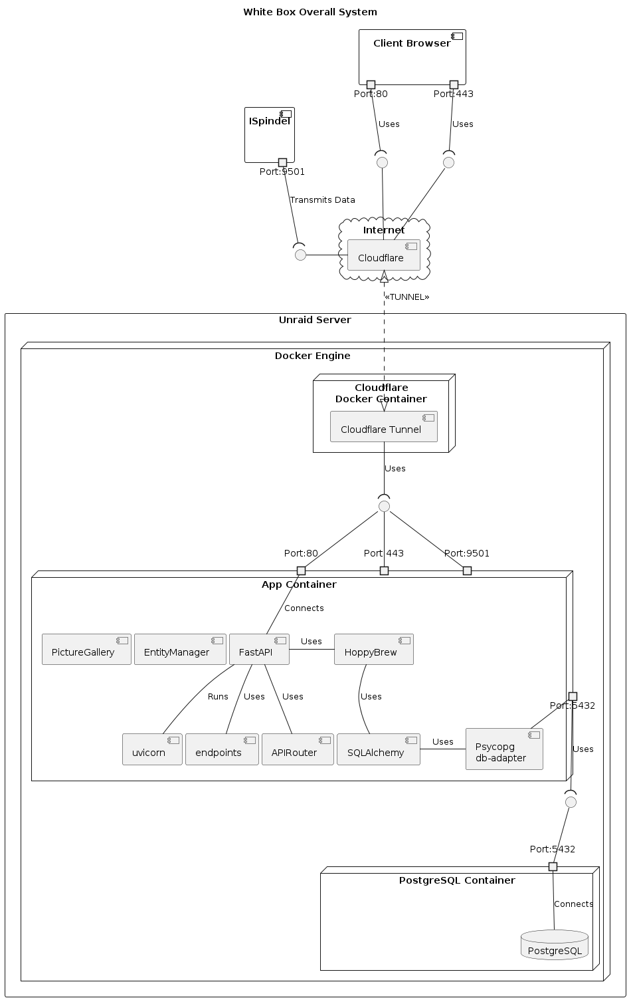
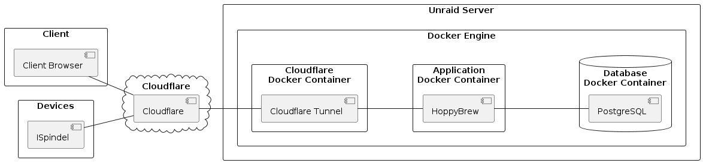

# Introduction and Goals

**This documentation:** is intended to provide a high-level overview of the HoppyBrew application. The document is based on the template provided by [@arc42]. Arc42 is a template for documenting software architectures. It is based on the ISO/IEC/IEEE 42010 standard, which is the international standard for documenting software architectures. The template is designed to be flexible and adaptable, and to be used in a wide range of software development projects. The template is divided into a number of sections, each of which covers a different aspect of the software architecture. The sections are designed to be used in a modular fashion, so that they can be used individually or in combination with other sections. The template is also designed to be easy to use, with a clear and consistent structure, and with a focus on the most important aspects of software architecture.

## Requirements Overview

***What is HoppyBrew?*** *HoppyBrew* is a web application designed to help beer-brewer enthusiasts manage their brewing recipes and brew logs. The application is intended to provide a user-friendly and intuitive interface for managing brewing recipes and brew logs. The application is designed to be compatible with a wide range of devices and browsers, and to integrate with other brewing tools and services, such as `iSpindel`. The application is targeted at beer brewer enthusiasts who want to manage their brewing recipes and brew logs in a simple and efficient way without the need for overpriced subscriptions fees like at [@Brewfather], [@BrewersFriend]  or [@BeerSmith].

***Why HoppyBrew?*** The thing which sets HoppyBrew apart from other brewing applications is that it is open-source and free to use. This means that users can use the application without having to pay any subscription fees. 

***Main Features:*** The main features of the application are as follows:

* Store and manage brewing recipes
* Create and manage batches based on recipes.
* Define water profiles for brewing recipes.
* Manage brewing profiles, such as mash profiles, fermentation profiles, equipment profiles, and beer style profiles.
* Interface with external devices, such as iSpindel, to collect real-time data.
* Manage inventory items, such as fermentables, hops, yeast, and miscellaneous items.
* Import and export recipes based on the BeerXML standard.

***Target Audience:*** The target audience for the application is a surprisingly large group of beer-brewer enthusiasts and self-hosting enthusiasts who want manage their brewing recipes and brew logs in a simple and efficient way. Without the need for overpriced subscriptions fees like at [@Brewfather], [@BrewersFriend]  or [@BeerSmith].

## Quality Goals

The top three quality goals for the architecture and design whose fulfillment is of highest importance to the major stakeholders of HoppyBrew have been identified as follows:

| **Priority** | **Quality**  | **Motivation** |
| - | - | ----- |
| 1 | Usability | The application should be easy to use and intuitive, with a clean and modern user interface. |
| 2 | Compatibility | The application should be compatible with a wide range of devices and browsers. (mobile, desktop, tablet) |
| 3 | Integration | The application should integrate with other brewing tools and services, such as iSpindel. |

Table: Quality goals and priorities for the application.

These quality goals are based on derived summaries of `ISO/IEC 25010 quality model` in [@arc42]. The quality requirements will be further detailed in section 10 "Quality Requirements" of this document.

  Right     Left     Center     Default
-------     ------ ----------   -------
     12     12        12            12
    123     123       123          123
      1     1          1             1

-------     ------ ----------   -------
     12     12        12             12
    123     123       123           123
      1     1          1              1
-------     ------ ----------   -------

-------------------------------------------------------------
 Centered   Default           Right Left
  Header    Aligned         Aligned Aligned
----------- ------- --------------- -------------------------
   First    row                12.0 Example of a row that
                                    spans multiple lines.

  Second    row                 5.0 Here's another one. Note
                                    the blank line between
                                    rows.
-------------------------------------------------------------

Table: Here's the caption. It, too, may span
multiple lines.

----------- ------- --------------- -------------------------
   First    row                12.0 Example of a row that
                                    spans multiple lines.

  Second    row                 5.0 Here's another one. Note
                                    the blank line between
                                    rows.
----------- ------- --------------- -------------------------

: Here's a multiline table without a header.

: Sample grid table.

+---------------+---------------+--------------------+
| Fruit         | Price         | Advantages         |
+===============+===============+====================+
| Bananas       | $1.34         | - built-in wrapper |
|               |               | - bright color     |
+---------------+---------------+--------------------+
| Oranges       | $2.10         | - cures scurvy     |
|               |               | - tasty            |
+---------------+---------------+--------------------+

+---------------------+----------+
| Property            | Earth    |
+=============+=======+==========+
|             | min   | -89.2 °C |
| Temperature +-------+----------+
| 1961-1990   | mean  | 14 °C    |
|             +-------+----------+
|             | max   | 56.7 °C  |
+-------------+-------+----------+

| Right | Left | Default | Center |
|------:|:-----|---------|:------:|
|   12  |  12  |    12   |    12  |
|  123  |  123 |   123   |   123  |
|    1  |    1 |     1   |     1  |

  : Demonstration of pipe table syntax.

# HTML

<table>
<tr>
<td>*one*</td>
<td>[a link](https://google.com)</td>
</tr>
</table>

into

<table>
<tr>
<td><em>one</em></td>
<td><a href="https://google.com">a link</a></td>
</tr>
</table>

## Stakeholders

In the architecture and design process of HoppyBrew, stakeholders play a pivotal role, providing essential requirements and constraints. Given that this project is part of a school assignment, the stakeholders are limited to the following individuals and their expectations:

| **Priority** | **Name/Category** | **Expectations** |
| - | -- | --- |
| **Primary** | Beer-brewer Enthusiast | Wants a user-friendly and intuitive application for managing brewing recipes and brew logs. |
| **Secondary** | Self-hosting Enthusiast and devellopers | Wants a high-quality, open-source application that is easy to maintain and extend. |
| **Tertiary** | The Software Architect | Wants a well-documented and well-structured application that meets the requirements of the assignment. On sucessful completion of the project, the Architect will be engolfed in a sense of pride and accomplishment. |

Table: Stakeholders and their expectations for the application.

It's important to recognize that since this is just a school project, the stakeholders are restricted to my own different personas.

### High-level Use Cases

The following use cases have been identified for the application:

<pre id="mycode" class="haskell numberLines" startFrom="100">
  <code>
@startuml 01-Use-Case-Diagram

left to right direction

actor Administrator as Admin
actor Brewer as Brewer
actor Database as DB
actor ISpindel as ISpindel
actor "{abstract}" as AbstractUser

Admin --|> AbstractUser
Brewer --|> AbstractUser

rectangle "HoppyBrew" as HoppyBrew {
    usecase "Manage  Users" as ManageUsers
    usecase "Manage Recipes" as ManageRecipes
    usecase "Define water profile" as DefineWaterProfile
    usecase "Create Batch" as CreateBatch
    usecase "Manage Batches" as ManageBatches
    usecase "{abstract}\nManage Profiles" as ManageProfiles
    usecase "Manage Devices" as ManageDevices
    usecase "Manage Inventory" as ManageInventory
    usecase "Manage System Settings" as ManageSystemSettings
    usecase "Collect\nRealtime Data" as CollectRealtimeData

    Admin --> ManageUsers
    AbstractUser --> ManageRecipes
    AbstractUser --> ManageBatches
    AbstractUser --> ManageProfiles
    AbstractUser --> ManageDevices
    AbstractUser --> ManageInventory
    AbstractUser --> ManageSystemSettings

    CreateBatch .> ManageBatches : <<extends>>

    ManageRecipes .> CreateBatch : <<extends>>
    CreateBatch --> DB

}

    ManageInventory --> DB
    ManageRecipes --> DB
    ManageProfiles --> DB
    
    ManageDevices <-- ISpindel
    CollectRealtimeData <-- ISpindel
    
@enduml
  </code>
</pre>

#### Actors

The following actors are involved in the use cases:

| **Actor** | **Description** |
| -- | ---- |
| **Admin** | The admin is responsible for managing the application and its users. |
| **Brewer** | The brewer is responsible for managing and creating brewing recipes and brews. |
| **ISpindel** | The iSpindel is responsible for providing data to the application. |
| **Database** | The database is responsible for storing and managing data for the application. |

Table: Actors involved in the use cases for the application.

#### Use Cases

The following use cases are supported by the application:

| **Id** | **Use Case** | **Description** |
| - | -- | ---- |
| **UC1** | **Manage Users** | The admin can manage users, including creating, updating, and deleting users. |
| **UC2** | **Manage Recipes** | The brewer can manage recipes, including creating, updating, and deleting recipes. |
| **UC3** | **Create Batch** | The brewer can create a batch based on a recipe. |
| **UC4** | **Manage Batches** | The brewer can manage batches, including creating, updating, and deleting batches. |
| **UC5** | **Manage Profiles** | The brewer can manage profiles, including creating, updating, and deleting profiles. |
| **UC6** | **Manage Devices** | The admin can manage devices, including creating, updating, and deleting devices. |
| **UC7** | **Manage Inventory** | The admin can manage inventory, including creating, updating, and deleting inventory items. |
| **UC8** | **Manage System Settings** | The admin can manage system settings, including updating system settings. |
| **UC9** | **Collect Realtime Data** | The iSpindel can collect realtime data and send it to the application. |

Table: High-level use cases for the application.

### Functional Requirements

The functional requirements for the application are based on the use cases that have been identified for the application. The use cases are intended to provide a high-level overview of the functionality that the application should support. The use cases are based on the requirements provided by the stakeholders and are intended to guide the architecture and design process in a way that ensures that the application meets the expectations of the stakeholders.

It is important to note that the difference between a use case and a functional requirement is that a use case describes a specific interaction between a user and the system, while a functional requirement describes a specific function or feature that the system should support. And although the use cases are based on the requirements provided by the stakeholders, the functional requirements are based on the use cases. Which means that the functional requirements are taking a step further and are more detailed than the use cases.

The functional requirements for the application are as follows:

| Id | Requirement | Description |
| - | -- | ---- |
| **FR1** | **User Management** | The application should support CRUD operations for users. |
| **FR2** | **Recipe Management** | The application should support CRUD operations for recipes. |
| **FR3** | **Batch Management** | The application should support CRUD operations for batches. |
| **FR4** | **{Profile Management}** | The application should support profile management |
| *FR4.1* | *Water Profile* | The application should support CRUD operations for water profiles. |
| *FR4.2* | *Mash Profile* | The application should support CRUD operations for mash profiles. |
| *FR4.3* | *Fermentation Profile* | The application should support CRUD operations for fermentation profiles.
| *FR4.4* | *Equipment Profile* | The application should support CRUD operations for equipment profiles. |
| *FR4.5* | *Beer Style Profile* | The application should support CRUD operations for beer style profiles. |
| **FR5** | **Device Management** | The application should support CRUD operations for devices. |
| *FR5.1* | *iSpindel* | The application should support CRUD operations for iSpindel. |
| **FR6** | **Inventory Management** | The application should support CRUD operations for inventory items. |
| *FR6.1* | *Fermentables* | The application should support CRUD operations for fermentables. |
| *FR6.2* | *Hops* | The application should support CRUD operations for hops. |
| *FR6.3* | *Yeast* | The application should support CRUD operations for yeast. |
| *FR6.4* | *Miscellaneous* | The application should support CRUD operations for miscellaneous items. |
| **FR7** | **System Settings** | The application should support system settings. |
| **FR8** | **Recipe Library** | The application should be able to import and export recipes based on the BeerXML standard. [@beerxml]|
| **FR9** | **Realtime Data Collection** | The application should be able to collect realtime data from iSpindel. |

Table: Functional requirements for the application.

> **Note!**
>
> - Requirements indicated with `{}` are abstract requirements that are further detailed in their respective sub-requirements.
>
> - CRUD stands for Create, Read, Update, and Delete.

### Non-functional Requirements

The non-functional requirements for the application are based on the quality goals that have been identified for the application. The quality goals are intended to provide a high-level overview of the most important quality attributes for the application, and to guide the architecture and design process in a way that ensures that these quality attributes are met. Unlike the functional requirements, the non-functional requirements not always so easily measurable, and are often more subjective in nature.

The non-functional requirements for the application are as follows:

| Id | Requirement | Description |
| - | -- | ---- |
| **NFR1** | **Usability** | The application should be easy to use and intuitive, with a clean and modern user interface. |
| **NFR2** | **Compatibility** | The application should be compatible with a wide range of devices and browsers. |
| **NFR3** | **Integration** | The application should integrate with other brewing tools and services, such as iSpindel. |
| **NFR4** | **Performance** | The application should be fast and responsive, with minimal latency. |
| **NFR5** | **Scalability** | The application should be able to handle a large number of users and data. |
| **NFR6** | **Reliability** | The application should be reliable and available, with minimal downtime. |
| **NFR7** | **Security** | The application should be secure, with user authentication and authorization. |
| **NFR8** | **Maintainability** | The application should be easy to maintain and extend, with clean and modular code. |
| **NFR9** | **Documentation** | The application should be well-documented, with clear and concise documentation. |
| **NFR10** | **Open-source** | The application should be open-source, with a permissive license. |

Table: Non-functional requirements for the application.

> **Note!**
>
> - The non-functional requirements are based on the quality goals that have been identified for the application.
>
> - The non-functional requirements are intended to provide a high-level overview of the most important quality attributes for the application.
> - The non-functional requirements are intended to guide the architecture and design process in a way that ensures that these quality attributes are met.

\clearpage

# Architecture Constraints

## Assumptions

When starting a new project, we often rely on certain assumptions based on the information we have at the time. Here are the assumptions we've made for this application:

1. **Online Learning:** We assume that any missing knowledge can be gained through online resources and documentation. This means we believe we can learn what we need to know about the technologies used in the project without too much difficulty, and in a reasonable amount of time.

## Constraints

1. **Deadline:** Since this is just a school project, we've got a deadline we need to meet. We've only got a certain amount of time to finish everything, including planning how the project will work. This deadline is set based on how much credit the project is worth and how much work we expect it to take. For example, since this project is worth 5 credits, we think it'll take about 150 hours to complete.

2. **Feature Limitations:** Because it's a school project, we're going to leave out some parts of the application that aren't super important. For instance, we might not implement every single type of action for all the different parts of the app. If we can do one type of action for one part, we'll assume we can do it for all the others.

3. **User Interface Simplification:** To keep things simple, we'll make the user interface as basic as possible while still showing how the app works. This means it won't look super fancy or work perfectly on every device, but it'll get the job done. We won't spend too much time on making it look pretty because that's not the main focus of the project.

## Dependencies

The application is dependent on the following external services and tools:

1. **iSpindel:** The application is dependent on iSpindel for collecting realtime data.
2. **Database:** The application is dependent on a database for storing and managing data.
3. **GitHub:** The application is dependent on GitHub for version control and collaboration.
4. **Docker:** The application is dependent on Docker for containerization and deployment.

## Risks

There are a number of risks associated with this project, which could potentially impact the success of the project. The following risks have been identified for the application:

1. **Technical Risks:** There is a risk that the technologies used in the project are not suitable for the requirements of the application.
2. **Time Risks:** There is a risk that the project will take longer than expected to complete, due to unforeseen circumstances.
3. **Skill development Risks:** There is a risk that the required knowledge for the project cannot be acquired in a reasonable amount of time.

\clearpage

# System Scope and Context

## Business Context

As indicated in the business context diagram below, the system only interacts with three external actors, namely the Administrator, The Brewer, and the ISpindel. The Administrator is responsible for managing the system, including adding new users, managing user roles, and monitoring the system. The Brewer is responsible for creating new brews, managing existing brews, and monitoring the progress of the brews. The ISpindel is responsible for collecting real-time data from the brewing process and sending it to the system.

<pre id="mycode" class="haskell numberLines" startFrom="100">
  <code>
@startuml 02-Context-Vew-Business

left to right direction

cloud iSpindle
actor Administrator
actor Brewer
rectangle "HoppiBrew" {
}

iSpindle --> HoppiBrew
Administrator --> HoppiBrew
Brewer --> HoppiBrew

@enduml
    </code>
</pre>

## Technical Context

From a technical perspective, the system interacts with several external systems and services. The system is dependent on the iSpindel for collecting real-time data from the brewing process. The system is also dependent on a database for storing and managing data. The system uses GitHub for version control and collaboration. Finally, the system uses Docker for containerization and deployment.

<pre id="mycode" class="haskell numberLines" startFrom="100">
  <code>
@startuml 03-Context-View-Technical

title Technical Context Diagram

actor user as "Operator"
boundary WebServer as "Web Server"
control AppServer as "Application Server"
entity Database as "SQLDatabase"
entity ISpindel as "iSpindel"

user -> WebServer : HTTP Request
WebServer -> AppServer : HTTP Request
AppServer -> Database : SQL Query
SQLDatabase -> AppServer : SQL Response
AppServer -> WebServer : HTTP Response
WebServer -> user : HTTP Response

ISpindel -> AppServer : HTTP Request
AppServer -> ISpindel : HTTP Response

@enduml
    </code>
</pre>

\clearpage

# Solution Strategy

## Technology Decisions

The application will be encapsulated in a containerized environment using Docker. This will allow for easy deployment and scaling of the application, as well as ensuring consistency across different environments. The application will be developed using a microservices architecture, with each component of the application running as a separate service. This will allow for greater flexibility and scalability, as well as making it easier to maintain and update the application.

### Frontend Technology

After evaluating the requirements and constraints of the project, we have decided to use Vue.js as the frontend technology for the application. This is because Vue.js is a lightweight and flexible JavaScript framework that allows for rapid development of single-page applications. It provides a simple and intuitive syntax, making it easy to learn and use, which is ideal for a school project with a tight deadline. Additionally, Vue.js has a large and active community, which means there are plenty of resources and support available for developers. This will help us overcome any challenges we may face during the development process.

### Backend Technology

The backend of the application will be developed using Python and FastAPI. FastAPI is a modern web framework for building APIs with Python. It is fast, easy to use, and provides automatic validation and serialization of request and response data. FastAPI is also based on standard Python type hints, which makes it easy to use and understand for developers who are familiar with Python. Additionally, FastAPI has built-in support for asynchronous programming, which allows for greater performance and scalability of the application. This makes it an ideal choice for building the backend of our application.

### Database Technology

The application will use PostgreSQL as the database technology. PostgreSQL is a powerful, open-source relational database management system that is widely used in the industry. It provides a rich set of features, including support for complex queries, transactions, and data integrity constraints. PostgreSQL is also highly scalable and reliable, making it suitable for use in production environments. Additionally, PostgreSQL has excellent support for JSON data types, which will be useful for storing and querying the data in our application. Overall, PostgreSQL is a solid choice for the database technology of our application.

### Deployment Technology

The application will be deployed using Docker and Docker Compose. Docker is a containerization platform that allows applications to be packaged into lightweight, portable containers that can run on any system. Docker Compose is a tool that allows multiple containers to be managed and orchestrated together. This will allow us to easily deploy and scale the application, as well as ensure consistency across different environments. Additionally, Docker and Docker Compose are widely used in the industry, which means there are plenty of resources and support available for developers. This will help us overcome any challenges we may face during the deployment process.

### Development Tools

The development of the application will be done using Visual Studio Code as the primary code editor. Visual Studio Code is a lightweight and powerful code editor that provides a rich set of features, including syntax highlighting, code completion, and debugging tools. It also has a large and active community, which means there are plenty of extensions and support available for developers. This will help us write clean and efficient code, as well as overcome any challenges we may face during the development process.

## Top-level Decomposition

The application will be decomposed into the following components:

1. Frontend
2. Backend
3. Database
4. Deployment

Each component will be developed and deployed as a separate service, which will communicate with each other using RESTful APIs. This will allow for greater flexibility and scalability, as well as making it easier to maintain and update the application. The frontend will be developed using Vue.js, the backend will be developed using Python and FastAPI, the database will be developed using PostgreSQL, and the deployment will be done using Docker and Docker Compose.

## Key Quality Goals

The key quality goals of the application are as follows:

1. Performance: The application should be fast and responsive, with low latency and high throughput.
2. Scalability: The application should be able to handle a large number of users and requests, and scale horizontally as needed.
3. Reliability: The application should be highly available and fault-tolerant, with minimal downtime and data loss.

To achieve these quality goals, we will use the following approaches:

1. Performance: We will use FastAPI for the backend, which is a high-performance web framework that is optimized for speed. We will also use PostgreSQL as the database technology, which is highly scalable and reliable. Additionally, we will use Docker and Docker Compose for deployment, which will allow us to easily scale the application as needed.
2. Scalability: We will use a microservices architecture for the application, with each component running as a separate service. This will allow for greater flexibility and scalability, as well as making it easier to maintain and update the application. We will also use Docker and Docker Compose for deployment, which will allow us to easily scale the application as needed.
3. Reliability: We will use PostgreSQL as the database technology, which is highly reliable and provides support for transactions and data integrity constraints. We will also use Docker and Docker Compose for deployment, which will allow us to easily manage and orchestrate multiple containers. Additionally, we will implement automated testing and monitoring to ensure the reliability of the application.

## Organizational Decisions

The application will be developed by a team of four developers, with each developer responsible for a specific component of the application. The team will follow an agile development process, with regular stand-up meetings, sprint planning, and retrospectives. The team will also use Git as the version control system, with a central repository hosted on GitHub. This will allow for easy collaboration and coordination between team members, as well as ensuring that the codebase is well-maintained and up-to-date.

## Motivation

The motivation for the chosen technology decisions is as follows:

1. Frontend Technology: Vue.js was chosen as the frontend technology because of its lightweight and flexible nature, as well as its large and active community. This will help us develop the frontend of the application quickly and efficiently, with plenty of resources and support available.
2. Backend Technology: FastAPI was chosen as the backend technology because of its speed, ease of use, and support for asynchronous programming. This will help us develop the backend of the application quickly and efficiently, with high performance and scalability.
3. Database Technology: PostgreSQL was chosen as the database technology because of its power, scalability, and reliability. This will help us store and query the data in the application efficiently and reliably, with support for complex queries and transactions.
4. Deployment Technology: Docker and Docker Compose were chosen as the deployment technology because of their containerization capabilities and ease of use. This will help us deploy and scale the application easily and consistently, with support for managing and orchestrating multiple containers.
5. Development Tools: Visual Studio Code was chosen as the primary code editor because of its lightweight and powerful nature, as well as its rich set of features and extensions. This will help us write clean and efficient code, with plenty of resources and support available.

## Solution Approaches

The solution approaches for the application are as follows:

1. Frontend: The frontend of the application will be developed using Vue.js, with a focus on simplicity, usability, and responsiveness. The frontend will communicate with the backend using RESTful APIs, with support for real-time updates and notifications.

2. Backend: The backend of the application will be developed using Python and FastAPI, with a focus on speed, performance, and scalability. The backend will provide a set of APIs for the frontend to interact with, with support for authentication, authorization, and validation.
3. Database: The database of the application will be developed using PostgreSQL, with a focus on reliability, scalability, and data integrity. The database will store the data in a structured and efficient manner, with support for complex queries and transactions.
4. Deployment: The application will be deployed using Docker and Docker Compose, with a focus on consistency, scalability, and reliability. The application will be packaged into lightweight and portable containers, which can run on any system. The containers will be managed and orchestrated using Docker Compose, which will allow for easy deployment and scaling of the application.

## Additional Considerations

Some additional considerations for the application are as follows:

1. Security: The application will implement security best practices, such as encryption, authentication, and authorization. This will help protect the data and privacy of the users, as well as prevent unauthorized access and attacks.
2. Monitoring: The application will implement monitoring and logging, to track the performance and availability of the application. This will help identify and resolve any issues or bottlenecks, as well as ensure the reliability of the application.
3. Testing: The application will implement automated testing, to ensure the quality and correctness of the code. This will help identify and fix any bugs or issues, as well as ensure the stability of the application.
4. Documentation: The application will implement documentation, to provide guidance and support for developers and users. This will help explain the architecture and design of the application, as well as provide instructions for installation and usage.
5. Compliance: The application will comply with relevant laws and regulations, such as data protection and privacy laws. This will help protect the rights and interests of the users, as well as ensure the legal and ethical operation of the application.
6. Accessibility: The application will implement accessibility best practices, to ensure that all users can access and use the application. This will help provide a positive and inclusive experience for all users, regardless of their abilities or disabilities.
7. Localization: The application will implement localization, to support multiple languages and regions. This will help reach a wider audience and improve the usability of the application, as well as provide a more personalized experience for users.

\clearpage

# Building Block View

## Whitebox Overall System

<pre id="mycode" class="haskell numberLines" startFrom="100">
  <code>
@startuml 04-white-box-overall-system

title White Box Overall System

interface " " as I01
interface " " as I02
interface " " as I03

component "Client Browser" as ClientBrowser{
    portout "Port:80" as ClientPort80
    portout "Port:443" as ClientPort443
}
component "ISpindel" as ISpindel{
    portout "Port:9501" as ISpindel_port
}

cloud "Internet" {
    component "Cloudflare" as cloudflare
}

ClientPort80 -down-( I01 : Uses
I01 -down- cloudflare 

ClientPort443 -down-( I02 : Uses
I02 -down- cloudflare

ISpindel_port --( I03 : Transmits Data
I03 - cloudflare 

rectangle "Unraid Server" {
    node "Docker Engine" {
        component "Cloudflare" as CloudflareTunnel

        cloudflare <|..|> CloudflareTunnel : <<TUNNEL>>

        node "App Container" as Application_Container {
            component "HoppyBrew" as HoppyBrew
            component "Psycopg\ndb-adapter" as db_adapter
            component "FastAPI" as api
            component "uvicorn" as uvicorn
            component "endpoints" as endpoints
            component "APIRouter" as APIRouter

            portin "Port:80" as port80
            portin "Port:443" as port443
            portin "Port:9501" as port9501
            portout "Port:5432" as port5432
            

            api - HoppyBrew : Uses
            HoppyBrew -- db_adapter : Uses
            api -- uvicorn  : Runs
            api -- endpoints  : Uses
            api -- APIRouter  : Uses

            
            port80 -down- api : Connects
            db_adapter -down- port5432 : Connects
        }

        interface " " as I04
        CloudflareTunnel --( I04 : Uses
        I04 -- port80
        I04 -- port443
        I04 -- port9501

        database "PostgreSQL Container" {
            component "PostgreSQL" as PostgreSQL
            portin "Port:5432" as PostgreSQL_port5432
            PostgreSQL_port5432 - PostgreSQL : Connects
        }

        interface " " as I05
        port5432 -down-( I05 : Uses
        I05 -down- PostgreSQL_port5432
    }
}
@enduml
    </code>
</pre>

The motivation for the decomposition is to separate the concerns of the different parts of the system. The client browser is responsible for displaying the data to the user, the ISpindel is responsible for collecting the data, and the Unraid Server is responsible for processing the data and storing it in the database. The Cloudflare service is responsible for routing the data between the client browser and the Unraid Server.

Contained Building Blocks 

| Building Block | Responsibilities |
| -------------- | ---------------- |
| Client Browser | Display data to the user |
| ISpindel | Collect data |
| Cloudflare | Route data between the client browser and the Unraid Server |
| App Container | Process data and store it in the database |
| PostgreSQL Container | Store data in the database |

Important Interfaces

{
    TODO: Description of important interfaces
}

## Blackbox Overall System

<pre id="mycode" class="haskell numberLines" startFrom="100">
  <code>
@startuml 05-black-box-overall-system

left to right direction

rectangle "Client Browser" {
    component "Client Browser" as client_browser
}

rectangle "ISpindel" {
    component "ISpindel" as iSpindel
}

rectangle "Cloudflare" {
    component "Cloudflare" as cloudflare
}

rectangle "HoppyBrew" {
    component "HoppyBrew" as hoppybrew
}

rectangle "PostgreSQL" {
    component "PostgreSQL" as postgres
}

client_browser -- cloudflare
iSpindel -- cloudflare
cloudflare -- hoppybrew
hoppybrew -- postgres

@enduml
    </code>
</pre>

### \<Name black box 1\>

### Client Browser

The client browser is responsible for displaying the data to the user. It communicates with the Cloudflare service to send and receive data.

### ISpindel

The ISpindel is responsible for collecting the data. It communicates with the Cloudflare service to send and receive data.

### Cloudflare

The Cloudflare service is responsible for routing the data between the client browser and the Unraid Server.

### HoppyBrew

The HoppyBrew application is responsible for processing the data and storing it in the database. It communicates with the Cloudflare service to send and receive data. It also communicates with the PostgreSQL database to store the data. This can also be seen as the business logic of the application.

### PostgreSQL

The PostgreSQL database is responsible for storing the data. It communicates with the HoppyBrew application to receive data.

\clearpage

# Runtime View

## \<Runtime Scenario 1\>

- *\<insert runtime diagram or textual description of the scenario\>*

- *\<insert description of the notable aspects of the interactions between the building block instances depicted in this diagram.\>*

## \<Runtime Scenario 2\>

## …

## \<Runtime Scenario n\>

# Deployment View

## Infrastructure Level 1

***\<Overview Diagram\>***

Motivation  
*\<explanation in text form\>*

Quality and/or Performance Features  
*\<explanation in text form\>*

Mapping of Building Blocks to Infrastructure  
*\<description of the mapping\>*

## Infrastructure Level 2

### *\<Infrastructure Element 1\>*

*\<diagram + explanation\>*

### *\<Infrastructure Element 2\>*

*\<diagram + explanation\>*

…

### *\<Infrastructure Element n\>*

*\<diagram + explanation\>*

\clearpage

# Cross-cutting Concepts

## *\<Concept 1\>*

*\<explanation\>*

## *\<Concept 2\>*

*\<explanation\>*

…

## *\<Concept n\>*

*\<explanation\>*

\clearpage

# Architecture Decisions

\clearpage

# Quality Requirements

## Quality Tree

## Quality Scenarios

\clearpage

# Risks and Technical Debts

\clearpage

# Glossary

| **Term**         | **Definition**         |
| - | ---- |
| **Actor** | in use case parlance, are parties outside the system that interact with the system. They may be users or other systems. Each actor defines a coherent set of roles users of the system can play (UML, 1999). Cockburn (1997) distinguishes between primary and secondary actors. A primary actor is one having a goal requiring the assistance of the system. A secondary actor is one from which the system needs assistance to satisfy its goal. |
| **Architecture** | The term software architecture is used both to refer to the high-level structure of software systems and the specialist discipline or field distinct from that of software engineering. The architecture of a software system identifies a set of components that collaborate to achieve the system goals. The architecture specifies the “externally visible” properties of the components-i.e., those assumptions other components can make of a component, such as its provided services, performance characteristics, fault handling, shared resource usage, and so on (Bass et al., 1998). It also specifies the relationships among the components and how they interact. |
| **Conceptual Architecture** | The intent of the conceptual architecture is to direct attention at an appropriate decomposition of the system without delving into the details of interface specification and type information. Moreover, it provides a useful vehicle for communicating the architecture to non-technical audiences, such as management, marketing, and many users. The conceptual architecture identifies the system components, the responsibilities of each component, and interconnections between components. The structural choices are driven by the system qualities, and the rationale section articulates and documents this connection between the architectural requirements and the structures (components and connectors or communication/co-ordination mechanisms) of the architecture. |
| **Features** | Features are the differentiating functionality of a product. This functionality may not be available in other products, or it may not be available with the same quality characteristics. |
| **Functional Requirements** | Functional requirements capture the intended behavior of the system-or what the system will do. This behavior may be expressed as services, tasks or functions the system is required to perform. |
| **Logical Architecture** | The logical architecture is the detailed architecture specification, precisely defining the component interfaces and connection mechanisms and protocols. It is used by the component designers and developers. |
| **Meta-architecture** | The meta-architecture is a set of high-level decisions that will strongly influence the structure of the system, but is not itself the structure of the system. The meta-architecture, through style, patterns of composition or interaction, principles, and philosophy, rules certain structural choices out, and guides selection decisions and trade-offs among others. By choosing communication or co-ordination mechanisms that are repeatedly applied across the architecture, a consistent approach is ensured and this simplifies the architecture. (See [Bredemeyer Consulting](http://www.bredemeyer.com/howto.htm) and [Bredemeyer Consulting](http://www.bredemeyer.com/whatis.htm).) |
| **Non-functional Requirements** | Non-functional requirements or system qualities, capture required properties of the system, such as performance, security, maintainability, etc.-in other words, how well some behavioral or structural aspect of the system should be accomplished. |
| **Product Line** | Product lines consist of basically similar products with different cost/feature variations per product. |
| **Product Family** | Product families include a number of product lines targeted at somewhat different markets or usage situations. What makes the product lines part of a family, are some common elements of functionality and identity. |
| **Qualities** | System qualities, or non-functional requirements, capture required properties of the system, such as performance, security, maintainability, etc.-in other words, how well some behavioral or structural aspect of the system should be accomplished. |
| **Scenario** | A scenario is an instance of a use case, and represents a single path through the use case. Thus, one may construct a scenario for the main flow through the use case, and other scenarios for each possible variation of flow through the use case (e.g., triggered by error conditions, security breaches, etc.). Scenarios may be depicted using sequence diagrams. |
| **Use Case** | A use case defines a goal-oriented set of interactions between external actors and the system under consideration. That is, use cases capture who (actors) does what (interactions) with the system, for what purpose (goal). A complete set of use cases specifies all the different ways to use the system, and thus defines all behavior required of the system--without dealing with the internal structure of the system. |
| **Use Case Diagram** | A use case diagram is a graphical representation of the use cases and their relationships to the actors. |
| **User Interface** | The user interface is the part of the system with which the users interact. It includes all the screens, forms, reports, and so on that the users use to interact with the system. |
| **User Story** | A user story is a short, simple description of a feature told from the perspective of the person who desires the new capability, usually a user or customer of the system. |
| **View** | A view is a representation of a whole system from the perspective of a related set of concerns. Views are used to describe the system from the viewpoint of different stakeholders, such as end-users, developers, system engineers, and project managers. Views are used to describe the system from the viewpoint of different stakeholders, such as end-users, developers, system engineers, and project managers. |
| **Viewpoint** | A viewpoint is a specification of the conventions for constructing and using a view. A viewpoint specifies not only the kinds of models that are to be constructed, but also the rules governing the construction of those models. |
| **Viewtype** | A viewtype is a template for a view. It specifies the types of models that are to be constructed, and the rules governing the construction of those models. |
| **Work Product** | A work product is a document or model that is produced as part of a software development process. Work products are used to capture and communicate information about the system being developed. |

\clearpage

# Bibliography

