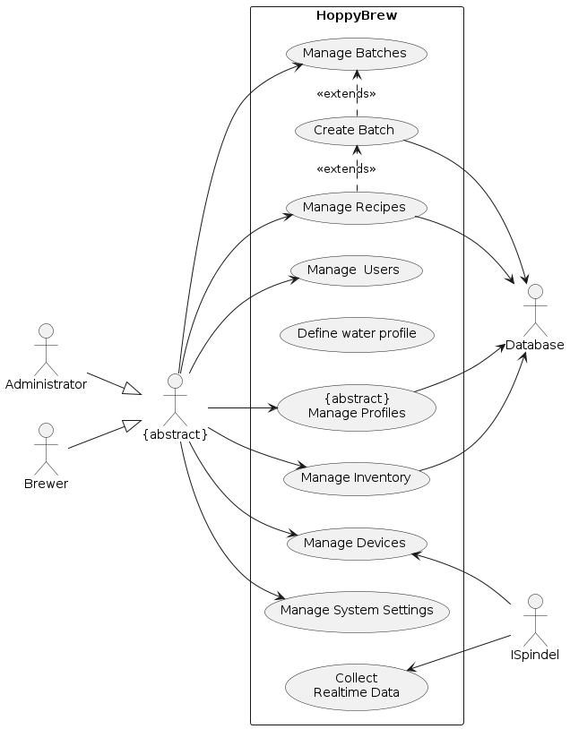

# Introduction and Goals

**This documentation:** is intended to provide a high-level overview of the HoppyBrew application. The document is based on the template provided by [@arc42]. Arc42 is a template for documenting software architectures. It is based on the ISO/IEC/IEEE 42010 standard, which is the international standard for documenting software architectures. The template is designed to be flexible and adaptable, and to be used in a wide range of software development projects. The template is divided into a number of sections, each of which covers a different aspect of the software architecture. The sections are designed to be used in a modular fashion, so that they can be used individually or in combination with other sections. The template is also designed to be easy to use, with a clear and consistent structure, and with a focus on the most important aspects of software architecture.

## Requirements Overview

***What is HoppyBrew?*** *HoppyBrew* is a web application designed to help beer-brewer enthusiasts manage their brewing recipes and brew logs. The application is intended to provide a user-friendly and intuitive interface for managing brewing recipes and brew logs. The application is designed to be compatible with a wide range of devices and browsers, and to integrate with other brewing tools and services, such as `iSpindel`. The application is targeted at beer brewer enthusiasts who want to manage their brewing recipes and brew logs in a simple and efficient way without the need for overpriced subscriptions fees like at [@Brewfather], [@BrewersFriend]  or [@BeerSmith].

***Why HoppyBrew?*** The thing which sets HoppyBrew apart from other brewing applications is that it is open-source and free to use. This means that users can use the application without having to pay any subscription fees. 

***Main Features:*** The main features of the application are as follows:

* Store and manage brewing recipes
* Create and manage batches based on recipes.
* Define water profiles for brewing recipes.
* Manage brewing profiles, such as mash profiles, fermentation profiles, equipment profiles, and beer style profiles.
* Interface with external devices, such as iSpindel, to collect real-time data.
* Manage inventory items, such as fermentables, hops, yeast, and miscellaneous items.
* Import and export recipes based on the BeerXML standard.

***Target Audience:*** The target audience for the application is a surprisingly large group of beer-brewer enthusiasts and self-hosting enthusiasts who want manage their brewing recipes and brew logs in a simple and efficient way. Without the need for overpriced subscriptions fees like at [@Brewfather], [@BrewersFriend]  or [@BeerSmith].

## Quality Goals

The top three quality goals for the architecture and design whose fulfillment is of highest importance to the major stakeholders of HoppyBrew have been identified as follows:

| **Priority** | **Quality**  | **Motivation** |
| - | - | ----- |
| 1 | Usability | The application should be easy to use and intuitive, with a clean and modern user interface. |
| 2 | Compatibility | The application should be compatible with a wide range of devices and browsers. (mobile, desktop, tablet) |
| 3 | Integration | The application should integrate with other brewing tools and services, such as iSpindel. |

Table: Quality goals and priorities for the application.

These quality goals are based on derived summaries of `ISO/IEC 25010 quality model` in [@arc42]. The quality requirements will be further detailed in section 10 "Quality Requirements" of this document.

<table data-header-hidden>
    <thead>
        <tr>
            <th width="110"></th>
            <th width="150"></th>
            <th width="440"></th>
        </tr>
    </thead>
    <tbody><tr><td><strong>Priority</strong></td><td><strong>Quality</strong></td><td><strong>Motivation</strong></td></tr><tr><td>1</td><td>Usability</td><td>The application should be easy to use and intuitive, with a clean and modern user interface.</td></tr><tr><td>2</td><td>Compatibility</td><td>The application should be compatible with a wide range of devices and browsers. (mobile, desktop, tablet)</td></tr><tr><td>3</td><td>Integration</td><td>The application should integrate with other brewing tools and services, such as iSpindel.</td></tr></tbody></table>

## Stakeholders

In the architecture and design process of HoppyBrew, stakeholders play a pivotal role, providing essential requirements and constraints. Given that this project is part of a school assignment, the stakeholders are limited to the following individuals and their expectations:

| **Priority** | **Name/Category** | **Expectations** |
| - | -- | --- |
| **Primary** | Beer-brewer Enthusiast | Wants a user-friendly and intuitive application for managing brewing recipes and brew logs. |
| **Secondary** | Self-hosting Enthusiast and devellopers | Wants a high-quality, open-source application that is easy to maintain and extend. |
| **Tertiary** | The Software Architect | Wants a well-documented and well-structured application that meets the requirements of the assignment. On sucessful completion of the project, the Architect will be engolfed in a sense of pride and accomplishment. |

Table: Stakeholders and their expectations for the application.

It's important to recognize that since this is just a school project, the stakeholders are restricted to my own different personas.

### High-level Use Cases

The following use cases have been identified for the application:

<pre id="mycode" class="haskell numberLines" startFrom="100">
  <code>
@startuml 01-Use-Case-Diagram

left to right direction

actor Administrator as Admin
actor Brewer as Brewer
actor Database as DB
actor ISpindel as ISpindel
actor "{abstract}" as AbstractUser

Admin --|> AbstractUser
Brewer --|> AbstractUser

rectangle "HoppyBrew" as HoppyBrew {
    usecase "Manage  Users" as ManageUsers
    usecase "Manage Recipes" as ManageRecipes
    usecase "Define water profile" as DefineWaterProfile
    usecase "Create Batch" as CreateBatch
    usecase "Manage Batches" as ManageBatches
    usecase "{abstract}\nManage Profiles" as ManageProfiles
    usecase "Manage Devices" as ManageDevices
    usecase "Manage Inventory" as ManageInventory
    usecase "Manage System Settings" as ManageSystemSettings
    usecase "Collect\nRealtime Data" as CollectRealtimeData

    Admin --> ManageUsers
    AbstractUser --> ManageRecipes
    AbstractUser --> ManageBatches
    AbstractUser --> ManageProfiles
    AbstractUser --> ManageDevices
    AbstractUser --> ManageInventory
    AbstractUser --> ManageSystemSettings

    CreateBatch .> ManageBatches : <<extends>>

    ManageRecipes .> CreateBatch : <<extends>>
    CreateBatch --> DB

}

    ManageInventory --> DB
    ManageRecipes --> DB
    ManageProfiles --> DB
    
    ManageDevices <-- ISpindel
    CollectRealtimeData <-- ISpindel
    
@enduml
  </code>
</pre>

#### Actors

The following actors are involved in the use cases:

| **Actor** | **Description** |
| -- | ---- |
| **Admin** | The admin is responsible for managing the application and its users. |
| **Brewer** | The brewer is responsible for managing and creating brewing recipes and brews. |
| **ISpindel** | The iSpindel is responsible for providing data to the application. |
| **Database** | The database is responsible for storing and managing data for the application. |

Table: Actors involved in the use cases for the application.

#### Use Cases

The following use cases are supported by the application:

| **Id** | **Use Case** | **Description** |
| - | -- | ---- |
| **UC1** | **Manage Users** | The admin can manage users, including creating, updating, and deleting users. |
| **UC2** | **Manage Recipes** | The brewer can manage recipes, including creating, updating, and deleting recipes. |
| **UC3** | **Create Batch** | The brewer can create a batch based on a recipe. |
| **UC4** | **Manage Batches** | The brewer can manage batches, including creating, updating, and deleting batches. |
| **UC5** | **Manage Profiles** | The brewer can manage profiles, including creating, updating, and deleting profiles. |
| **UC6** | **Manage Devices** | The admin can manage devices, including creating, updating, and deleting devices. |
| **UC7** | **Manage Inventory** | The admin can manage inventory, including creating, updating, and deleting inventory items. |
| **UC8** | **Manage System Settings** | The admin can manage system settings, including updating system settings. |
| **UC9** | **Collect Realtime Data** | The iSpindel can collect realtime data and send it to the application. |

Table: High-level use cases for the application.

### Functional Requirements

The functional requirements for the application are based on the use cases that have been identified for the application. The use cases are intended to provide a high-level overview of the functionality that the application should support. The use cases are based on the requirements provided by the stakeholders and are intended to guide the architecture and design process in a way that ensures that the application meets the expectations of the stakeholders.

It is important to note that the difference between a use case and a functional requirement is that a use case describes a specific interaction between a user and the system, while a functional requirement describes a specific function or feature that the system should support. And although the use cases are based on the requirements provided by the stakeholders, the functional requirements are based on the use cases. Which means that the functional requirements are taking a step further and are more detailed than the use cases.

The functional requirements for the application are as follows:

| Id | Requirement | Description |
| - | -- | ---- |
| **FR1** | **User Management** | The application should support CRUD operations for users. |
| **FR2** | **Recipe Management** | The application should support CRUD operations for recipes. |
| **FR3** | **Batch Management** | The application should support CRUD operations for batches. |
| **FR4** | **{Profile Management}** | The application should support profile management |
| *FR4.1* | *Water Profile* | The application should support CRUD operations for water profiles. |
| *FR4.2* | *Mash Profile* | The application should support CRUD operations for mash profiles. |
| *FR4.3* | *Fermentation Profile* | The application should support CRUD operations for fermentation profiles.
| *FR4.4* | *Equipment Profile* | The application should support CRUD operations for equipment profiles. |
| *FR4.5* | *Beer Style Profile* | The application should support CRUD operations for beer style profiles. |
| **FR5** | **Device Management** | The application should support CRUD operations for devices. |
| *FR5.1* | *iSpindel* | The application should support CRUD operations for iSpindel. |
| **FR6** | **Inventory Management** | The application should support CRUD operations for inventory items. |
| *FR6.1* | *Fermentables* | The application should support CRUD operations for fermentables. |
| *FR6.2* | *Hops* | The application should support CRUD operations for hops. |
| *FR6.3* | *Yeast* | The application should support CRUD operations for yeast. |
| *FR6.4* | *Miscellaneous* | The application should support CRUD operations for miscellaneous items. |
| **FR7** | **System Settings** | The application should support system settings. |
| **FR8** | **Recipe Library** | The application should be able to import and export recipes based on the BeerXML standard. [@beerxml]|
| **FR9** | **Realtime Data Collection** | The application should be able to collect realtime data from iSpindel. |

Table: Functional requirements for the application.

> **Note!**
>
> - Requirements indicated with `{}` are abstract requirements that are further detailed in their respective sub-requirements.
>
> - CRUD stands for Create, Read, Update, and Delete.

### Non-functional Requirements

The non-functional requirements for the application are based on the quality goals that have been identified for the application. The quality goals are intended to provide a high-level overview of the most important quality attributes for the application, and to guide the architecture and design process in a way that ensures that these quality attributes are met. Unlike the functional requirements, the non-functional requirements not always so easily measurable, and are often more subjective in nature.

The non-functional requirements for the application are as follows:

| Id | Requirement | Description |
| - | -- | ---- |
| **NFR1** | **Usability** | The application should be easy to use and intuitive, with a clean and modern user interface. |
| **NFR2** | **Compatibility** | The application should be compatible with a wide range of devices and browsers. |
| **NFR3** | **Integration** | The application should integrate with other brewing tools and services, such as iSpindel. |
| **NFR4** | **Performance** | The application should be fast and responsive, with minimal latency. |
| **NFR5** | **Scalability** | The application should be able to handle a large number of users and data. |
| **NFR6** | **Reliability** | The application should be reliable and available, with minimal downtime. |
| **NFR7** | **Security** | The application should be secure, with user authentication and authorization. |
| **NFR8** | **Maintainability** | The application should be easy to maintain and extend, with clean and modular code. |
| **NFR9** | **Documentation** | The application should be well-documented, with clear and concise documentation. |
| **NFR10** | **Open-source** | The application should be open-source, with a permissive license. |

Table: Non-functional requirements for the application.

> **Note!**
>
> - The non-functional requirements are based on the quality goals that have been identified for the application.
>
> - The non-functional requirements are intended to provide a high-level overview of the most important quality attributes for the application.
> - The non-functional requirements are intended to guide the architecture and design process in a way that ensures that these quality attributes are met.

\clearpage
