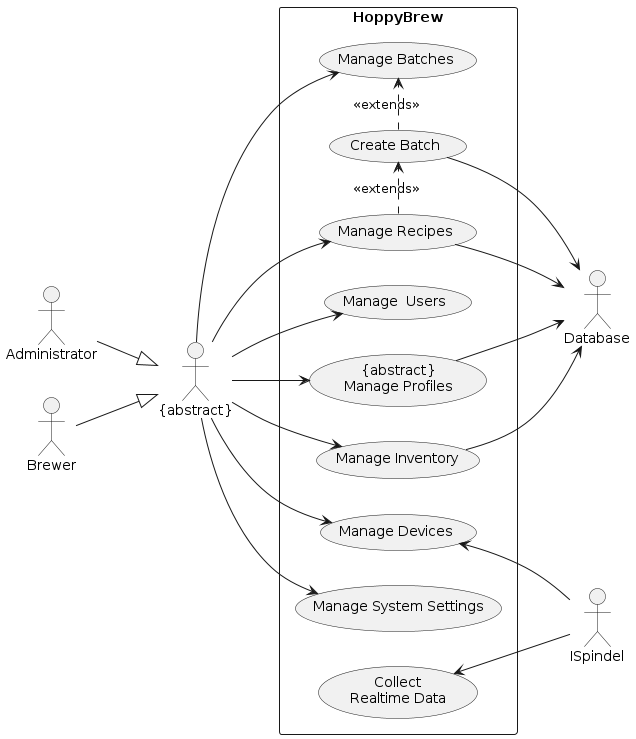
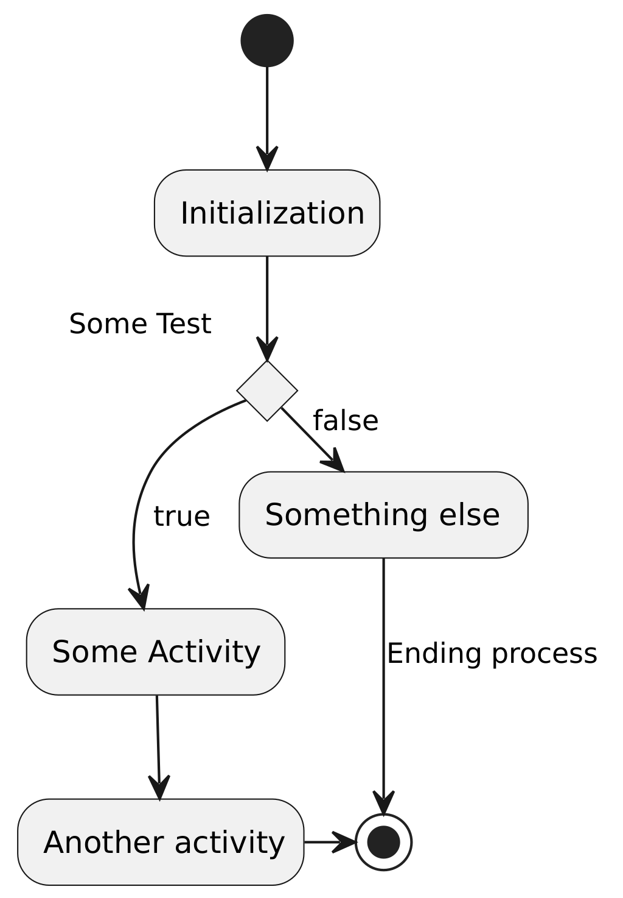

# Introduction and Goals

This document outlines the architecture and design of HoppyBrew, a web-based application for managing brewing recipes and brews. The application is designed to be user-friendly and intuitive, with a clean and modern user interface. The application is also designed to be compatible with a wide range of devices and browsers, and to integrate with other brewing tools and services, such as `iSpindel`.

Note\! The terminology `brew` and `batch` are used interchangeably in this document to refer to the same thing, i.e. a single brewing process.

## Quality Goals

The top three quality goals for the architecture and design whose fulfillment is of highest importance to the major stakeholders of HoppyBrew have been identified as follows:[@AddisonWesley2007]

| **Priority**  | **Quality Goal** |
| -             | ------- |
| **1**         | **Usability:** The application should be easy to use and intuitive, with a clean and modern user interface. |
| **2**         | **Compatibility:** The application should be compatible with a wide range of devices and browsers. (mobile, desktop, tablet) |
| **3**         | **Integration:** The application should integrate with other brewing tools and services, such as `iSpindel`. |

Table: Quality goals and priorities for the application.

The motivation behind these goals are to ensure that the application lives up to the expectations of the most important stakeholders, since they are the ones who will be the ones who influence the fundamental architecture and design decisions.

## Stakeholders

In the architecture and design process of HoppyBrew, stakeholders play a pivotal role, providing essential requirements and constraints. Given that this project is part of a school assignment, the stakeholders are limited to the following individuals and their expectations:

| **Priority** | **Name/Category** | **Expectations** |
| - | -- | --- |
| **Primary** | Beer Brewer Enthusiast | Wants a user-friendly and intuitive application for managing brewing recipes and brew logs. |
| **Secondary** | Self-hosting Enthusiast and devellopers | Wants a high-quality, open-source application that is easy to maintain and extend. |

## Requirements Overview

HoppyBrew is driven by the following essential features and functional requirements:

| **Id** | **Requirement**                                    | **Explanation**                                                                       |
| ------ | -------------------------------------------------- | ------------------------------------------------------------------------------------- |
| **F1** | **Manage and create brewing recipes**              | The application should allow users to manage and create brewing recipes.              |
| **F2** | **Manage and create brews and log their progress** | The application should allow users to manage and create brews and log their progress. |

And here is the file

[@Brewfather]
