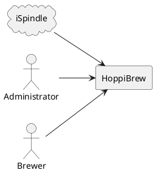
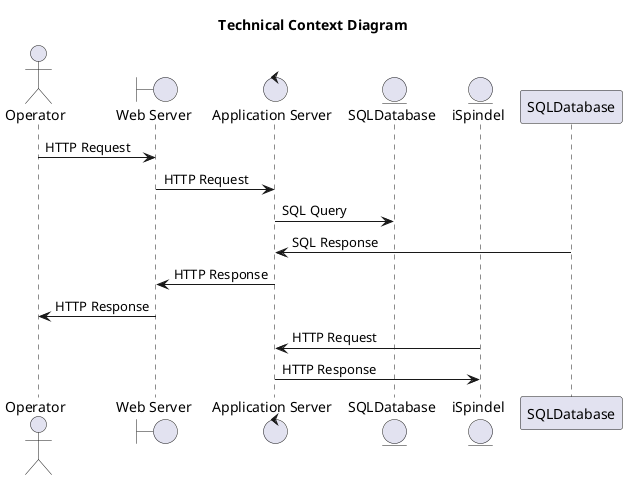

# System Scope and Context

## Business Context

As indicated in the business context diagram below, the system only interacts with three external actors, namely the Administrator, The Brewer, and the ISpindel. The Administrator is responsible for managing the system, including adding new users, managing user roles, and monitoring the system. The Brewer is responsible for creating new brews, managing existing brews, and monitoring the progress of the brews. The ISpindel is responsible for collecting real-time data from the brewing process and sending it to the system.

## Technical Context

From a technical perspective, the system interacts with several external systems and services. The system is dependent on the iSpindel for collecting real-time data from the brewing process. The system is also dependent on a database for storing and managing data. The system uses GitHub for version control and collaboration. Finally, the system uses Docker for containerization and deployment.

\clearpage
