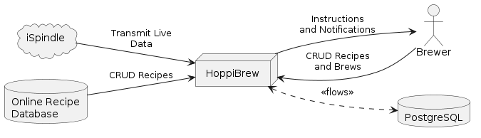
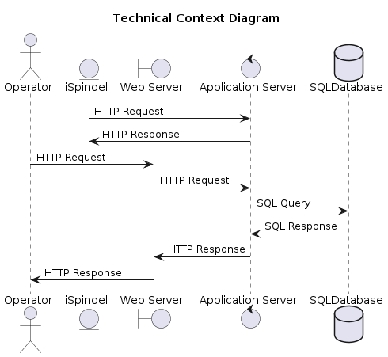

# System Scope and Context

## Business Context

As indicated in the business context diagram below, the system only interacts with three external actors, namely the Administrator, The Brewer, and the ISpindel. The Administrator is responsible for managing the system, including adding new users, managing user roles, and monitoring the system. The Brewer is responsible for creating new brews, managing existing brews, and monitoring the progress of the brews. The ISpindel is responsible for collecting real-time data from the brewing process and sending it to the system.

<pre id="mycode" class="haskell numberLines" startFrom="100">
  <code>
@startuml 02-Context-Vew-Business

left to right direction

cloud iSpindle
actor Brewer
database "Online Recipe\nDatabase" as RecipeDB

node "HoppiBrew" as HoppiBrew
database "PostgreSQL" as PostgreSQL

RecipeDB --> HoppiBrew : CRUD Recipes
iSpindle --> HoppiBrew : Transmit Live\nData
Brewer --> HoppiBrew : CRUD Recipes\nand Brews
HoppiBrew <..> PostgreSQL : <<flows>>
HoppiBrew --> Brewer : Instructions\nand Notifications
@enduml
    </code>
</pre>

**Brewer:** The Brewer is responsible for creating new brews, managing existing brews, and monitoring the progress of the brews. The Brewer interacts with the system to create new recipes, manage existing recipes, and monitor the progress of the brews.

**Administrator:** The Administrator is responsible for managing the system, including adding new users, managing user roles, and monitoring the system. The Administrator interacts with the system to add new users, manage user roles, and monitor the system.

**iSpindel:** The iSpindel is responsible for collecting real-time data from the brewing process and sending it to the system. The iSpindel interacts with the system to transmit live data from the brewing process.

**Online Recipe Database:** The Online Recipe Database is responsible for storing and managing recipes for the system. The Online Recipe Database interacts with the system to store and retrieve recipes.

**HoppyBrew:** HoppyBrew is the system that is being developed. It is responsible for managing brewing recipes and brew logs. HoppyBrew interacts with the Brewer, Administrator, iSpindel, and Online Recipe Database to provide the functionality of the system.

**PostgreSQL:** PostgreSQL is the database technology that is being used to store and manage data for the system. PostgreSQL interacts with HoppyBrew to store and retrieve data.

## Use Case Diagram

The following use cases have been identified for the application:

<pre id="mycode" class="haskell numberLines" startFrom="100">
  <code>
@startuml 01-Use-Case-Diagram

left to right direction

actor Administrator as Admin
actor Brewer as Brewer
actor Database as DB
actor ISpindel as ISpindel
actor "{abstract}" as AbstractUser

Admin --|> AbstractUser
Brewer --|> AbstractUser

rectangle "HoppyBrew" as HoppyBrew {
    usecase "Manage  Users" as ManageUsers
    usecase "Manage Recipes" as ManageRecipes
    usecase "Define water profile" as DefineWaterProfile
    usecase "Create Batch" as CreateBatch
    usecase "Manage Batches" as ManageBatches
    usecase "{abstract}\nManage Profiles" as ManageProfiles
    usecase "Manage Devices" as ManageDevices
    usecase "Manage Inventory" as ManageInventory
    usecase "Manage System Settings" as ManageSystemSettings
    usecase "Collect\nRealtime Data" as CollectRealtimeData

    Admin --> ManageUsers
    AbstractUser --> ManageRecipes
    AbstractUser --> ManageBatches
    AbstractUser --> ManageProfiles
    AbstractUser --> ManageDevices
    AbstractUser --> ManageInventory
    AbstractUser --> ManageSystemSettings

    CreateBatch .> ManageBatches : <<extends>>

    ManageRecipes .> CreateBatch : <<extends>>
    CreateBatch --> DB

}

    ManageInventory --> DB
    ManageRecipes --> DB
    ManageProfiles --> DB
    
    ManageDevices <-- ISpindel
    CollectRealtimeData <-- ISpindel
    
@enduml
  </code>
</pre>

#### Actors

The following actors are involved in the use cases:

| **Actor** | **Description** |
| -- | ---- |
| **Admin** | The admin is responsible for managing the application and its users. |
| **Brewer** | The brewer is responsible for managing and creating brewing recipes and brews. |
| **ISpindel** | The iSpindel is responsible for providing data to the application. |
| **Database** | The database is responsible for storing and managing data for the application. |

Table: Actors involved in the use cases for the application.

#### Use Cases

The following use cases are supported by the application:

| **Id** | **Use Case** | **Description** |
| - | -- | ---- |
| **UC1** | **Manage Users** | The admin can manage users, including creating, updating, and deleting users. |
| **UC2** | **Manage Recipes** | The brewer can manage recipes, including creating, updating, and deleting recipes. |
| **UC3** | **Create Batch** | The brewer can create a batch based on a recipe. |
| **UC4** | **Manage Batches** | The brewer can manage batches, including creating, updating, and deleting batches. |
| **UC5** | **Manage Profiles** | The brewer can manage profiles, including creating, updating, and deleting profiles. |
| **UC6** | **Manage Devices** | The admin can manage devices, including creating, updating, and deleting devices. |
| **UC7** | **Manage Inventory** | The admin can manage inventory, including creating, updating, and deleting inventory items. |
| **UC8** | **Manage System Settings** | The admin can manage system settings, including updating system settings. |
| **UC9** | **Collect Realtime Data** | The iSpindel can collect realtime data and send it to the application. |

Table: High-level use cases for the application.

## Technical Context

From a technical perspective, the system interacts with several external systems and services. The system is dependent on the iSpindel for collecting real-time data from the brewing process. The system is also dependent on a database for storing and managing data. The system uses GitHub for version control and collaboration. Finally, the system uses Docker for containerization and deployment.

TODO: Create a new diagram for the technical context view.

The technical context diagram provides a high-level overview of the technical environment in which the system operates. The diagram shows the system and its interactions with external systems and services. The diagram also shows the dependencies of the system on external systems and services.

<pre id="mycode" class="haskell numberLines" startFrom="100">
  <code>
@startuml 03-Context-View-Technical

title Technical Context Diagram

actor user as "Operator"
entity ISpindel as "iSpindel"
boundary WebServer as "Web Server"
control AppServer as "Application Server"
database Database as "SQLDatabase"

ISpindel -> AppServer : HTTP Request
AppServer -> ISpindel : HTTP Response

user -> WebServer : HTTP Request
WebServer -> AppServer : HTTP Request
AppServer -> Database : SQL Query
Database -> AppServer : SQL Response
AppServer -> WebServer : HTTP Response
WebServer -> user : HTTP Response

@enduml
    </code>
</pre>

**Backend:** The backend of the application is responsible for processing the data and storing it in the database. The backend communicates with the frontend using RESTful APIs. The backend is developed using Python and FastAPI, with PostgreSQL as the database technology.

**Frontend:** The frontend of the application is responsible for displaying the data to the user. The frontend communicates with the backend using RESTful APIs.

**Database:** The database of the application is responsible for storing and managing the data. The database communicates with the backend using SQL queries.

### Built With

The project is built using the following technologies:

#### Integrated Development Environment (IDE):

| Technology | Description |
| --- | --- |
| [![VsCode][VsCode]][VsCode-url] | Visual Studio Code is a source-code editor developed by Microsoft for Windows, Linux, and macOS. |

#### Frontend:

| Technology | Description |
| --- | --- |
| [![Vue][Vue.js]][Vue-url] | A progressive JavaScript framework for building user interfaces. |

#### Backend:

| Technology | Description |
| --- | --- |
| [![Python][Python.org]][Python-url] | Python is an interpreted high-level general-purpose programming language. |
| [![FastAPI][FastAPI.org]][FastAPI-url] | FastAPI is a modern, fast (high-performance), web framework for building APIs with Python 3.6+ based on standard Python type hints. |
| [![Flask][Flask.pocoo]][Flask-url] | Flask is a lightweight WSGI web application framework. It is designed to make getting started quick and easy, with the ability to scale up to complex applications. |
| [![sqlalchemy][sqlalchemy]][sqlalchemy-url] | SQLAlchemy is the Python SQL toolkit and Object Relational Mapper that gives application developers the full power and flexibility of SQL. |
| [![uvicorn][uvicorn]][uvicorn-url] | Uvicorn is a lightning-fast ASGI server implementation, using uvloop and httptools. |
| [![pydantic][pydantic]][pydantic-url] | Pydantic is a data validation and settings management using Python type annotations. |

#### Database:

| Technology | Description |
| --- | --- |
| [![PostgreSQL][PostgreSQL.org]][PostgreSQL-url] | PostgreSQL is a powerful, open-source object-relational database system. |
| [![SQLite][SQLite]][SQLite-url] | SQLite is a C-language library that implements a small, fast, self-contained, high-reliability, full-featured, SQL database engine. |
| [![Redis][Redis]][Redis-url] | Redis is an open-source, in-memory data structure store, used as a database, cache, and message broker. |

#### Infrastructure/DevOps:

| Technology | Description |
| --- | --- |
| [![Docker][Docker.com]][Docker-url] | Docker is a set of platform as a service products that use OS-level virtualization to deliver software in packages called containers. |
| [![Alpine Linux][Alpine Linux]][Alpine Linux-url] | Alpine Linux is a Linux distribution based on musl and BusyBox, designed for security, simplicity, and resource efficiency. |
| [![Ubuntu][Ubuntu]][Ubuntu-url] | Ubuntu is a Linux distribution based on Debian and composed mostly of free and open-source software. |
| [![GitHub][GitHub]][GitHub-url] | GitHub is a web-based platform for version control and collaboration. |
| [![DockerHub][dockerhub.com]][dockerhub-url] | DockerHub is a cloud-based registry service that allows you to link to code repositories, build your images, test them, and distribute them. |
| [![Git][Git-scm]][Git-scm-url] | Git is a distributed version-control system for tracking changes in source code during software development. |
| [![Unraid][Unraid]][Unraid-url] | Unraid is an operating system that brings enterprise-class features for personal and small business applications. |

#### Documentation:

| Technology | Description |
| --- | --- |
| [![Markdown][Markdown]][Markdown-url] | Markdown is a lightweight markup language with plain-text-formatting syntax. |
| [![PlantUML][PlantUML]][PlantUML-url] | PlantUML is an open-source tool allowing users to create UML diagrams from a plain text language. |
| [![PanDoc][pandoc]][pandoc-url] | Pandoc is a free and open-source document converter, widely used as a writing tool (especially by scholars) and as a basis for publishing workflows. |
| [![GitBook][GitBook]][GitBook-url] | GitBook is a modern documentation platform where teams can document everything from products to internal knowledge-bases and APIs. |

\clearpage
