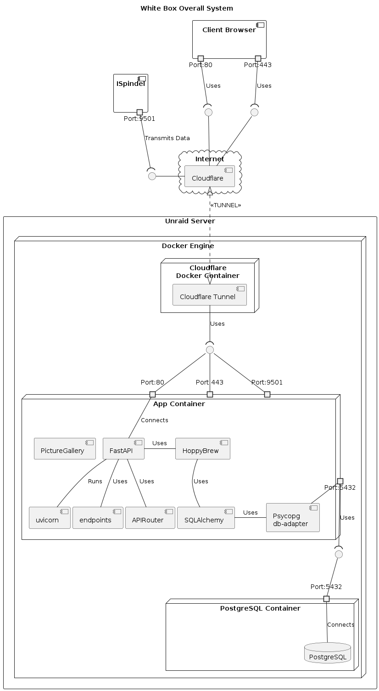
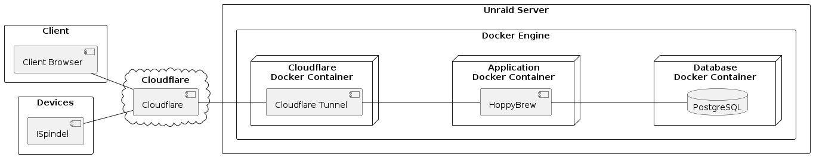

# Building Block View

## Whitebox Overall System

The motivation for the decomposition is to separate the concerns of the different parts of the system. The client browser is responsible for displaying the data to the user, the ISpindel is responsible for collecting the data, and the Unraid Server is responsible for processing the data and storing it in the database. The Cloudflare service is responsible for routing the data between the client browser and the Unraid Server.

Contained Building Blocks 

| Building Block | Responsibilities |
| -------------- | ---------------- |
| Client Browser | Display data to the user |
| ISpindel | Collect data |
| Cloudflare | Route data between the client browser and the Unraid Server |
| App Container | Process data and store it in the database |
| PostgreSQL Container | Store data in the database |

Important Interfaces

{
    TODO: Description of important interfaces
}

## Blackbox Overall System

### \<Name black box 1\>

### Client Browser

The client browser is responsible for displaying the data to the user. It communicates with the Cloudflare service to send and receive data.

### ISpindel

The ISpindel is responsible for collecting the data. It communicates with the Cloudflare service to send and receive data.

### Cloudflare

The Cloudflare service is responsible for routing the data between the client browser and the Unraid Server.

### HoppyBrew

The HoppyBrew application is responsible for processing the data and storing it in the database. It communicates with the Cloudflare service to send and receive data. It also communicates with the PostgreSQL database to store the data. This can also be seen as the business logic of the application.

### PostgreSQL

The PostgreSQL database is responsible for storing the data. It communicates with the HoppyBrew application to receive data.

\clearpage
