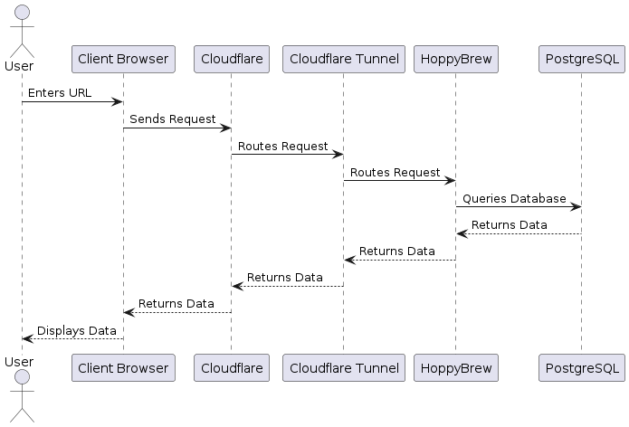

# Runtime View

User interactions with the system are depicted in the following sequence diagrams.

## User Login

<pre id="mycode" class="haskell numberLines" startFrom="100">
  <code>
@startuml 06-User-Login

actor User as User
participant "Client Browser" as ClientBrowser
participant "Cloudflare" as Cloudflare
participant "Cloudflare Tunnel" as CloudflareTunnel
participant "HoppyBrew" as HoppyBrew
participant "PostgreSQL" as PostgreSQL

User -> ClientBrowser : Enters URL
ClientBrowser -> Cloudflare : Sends Request
Cloudflare -> CloudflareTunnel : Routes Request
CloudflareTunnel -> HoppyBrew : Routes Request
HoppyBrew -> PostgreSQL : Queries Database
PostgreSQL --> HoppyBrew : Returns Data
HoppyBrew --> CloudflareTunnel : Returns Data
CloudflareTunnel --> Cloudflare : Returns Data
Cloudflare --> ClientBrowser : Returns Data
ClientBrowser --> User : Displays Data

@enduml
    </code>
</pre>

## User Logout

## \<Runtime Scenario 1\>

- *\<insert runtime diagram or textual description of the scenario\>*

- *\<insert description of the notable aspects of the interactions between the building block instances depicted in this diagram.\>*

## \<Runtime Scenario 2\>

## …

## \<Runtime Scenario n\>
