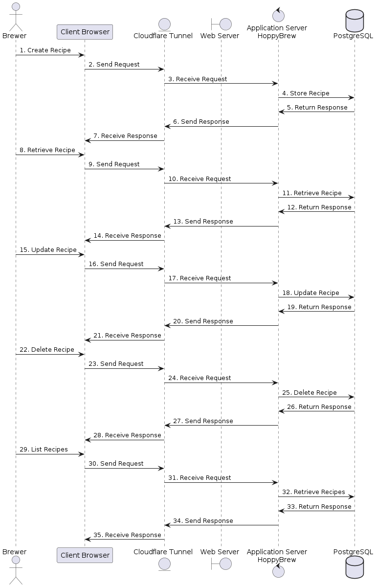

# Runtime View

User interactions with the system are depicted in the following sequence diagrams.

## CRUD Recipe

As all CRUD operations follow the same pattern, the CRUD operations for the other entities are not depicted here.

<pre id="mycode" class="haskell numberLines" startFrom="100">
  <code>
@startuml 06-Runtime-View-CRUD-Recipe

actor Brewer as Brewer
participant "Client Browser" as ClientBrowser
participant "Cloudflare Tunnel" as CloudflareTunnel
participant "HoppyBrew" as HoppyBrew
participant "PostgreSQL" as PostgreSQL

Brewer -> ClientBrowser : 1. Create Recipe
ClientBrowser -> CloudflareTunnel : 2. Send Request
CloudflareTunnel -> HoppyBrew : 4. Receive Request
HoppyBrew -> PostgreSQL : 5. Store Recipe
PostgreSQL -> HoppyBrew : 6. Return Response
HoppyBrew -> CloudflareTunnel : 7. Send Response
CloudflareTunnel -> ClientBrowser : 9. Receive Response

@enduml
    </code>
</pre>

## CRUD Batch

A new Batch recipe is instantiated from an existing Recipe. The Brewer can then modify the Batch recipe as needed.

<pre id="mycode" class="haskell numberLines" startFrom="100">
  <code>
@startuml 07-Runtime-View-CRUD-Batch

actor Brewer as Brewer
participant "Client Browser" as ClientBrowser
participant "Cloudflare Tunnel" as CloudflareTunnel
participant "HoppyBrew" as HoppyBrew
participant "PostgreSQL" as PostgreSQL

Brewer -> ClientBrowser : 1. List Recipes
ClientBrowser -> CloudflareTunnel : 2. Send Request
CloudflareTunnel -> HoppyBrew : 4. Receive Request
HoppyBrew -> PostgreSQL : 5. Retrieve Recipes
PostgreSQL -> HoppyBrew : 6. Return Response
HoppyBrew -> CloudflareTunnel : 7. Send Response
CloudflareTunnel -> ClientBrowser : 9. Receive Response

Brewer -> ClientBrowser : 10. Instantiate Batch from Recipe
ClientBrowser -> CloudflareTunnel : 11. Send Request
CloudflareTunnel -> HoppyBrew : 12. Receive Request
HoppyBrew -> PostgreSQL : 13. Retrieve Recipe
PostgreSQL -> HoppyBrew : 14. Return Response
HoppyBrew -> CloudflareTunnel : 15. Send Response
CloudflareTunnel -> ClientBrowser : 16. Receive Response

Brewer -> ClientBrowser : 17. Modify Batch
ClientBrowser -> CloudflareTunnel : 18. Send Request
CloudflareTunnel -> HoppyBrew : 19. Receive Request
HoppyBrew -> PostgreSQL : 20. Store Batch
PostgreSQL -> HoppyBrew : 21. Return Response
HoppyBrew -> CloudflareTunnel : 22. Send Response
CloudflareTunnel -> ClientBrowser : 23. Receive Response

@enduml
    </code>
</pre>

## \<Runtime Scenario 1\>

- *\<insert runtime diagram or textual description of the scenario\>*

- *\<insert description of the notable aspects of the interactions between the building block instances depicted in this diagram.\>*

## \<Runtime Scenario 2\>

## …

## \<Runtime Scenario n\>
