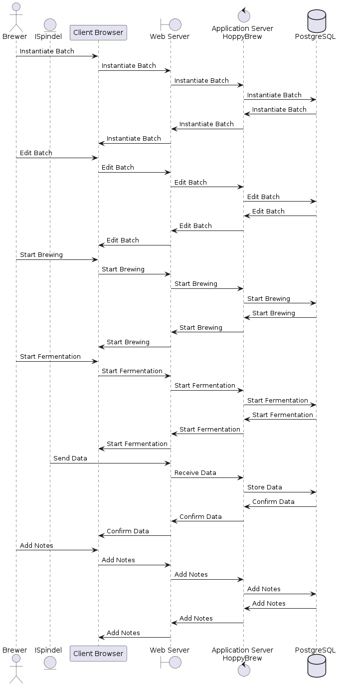
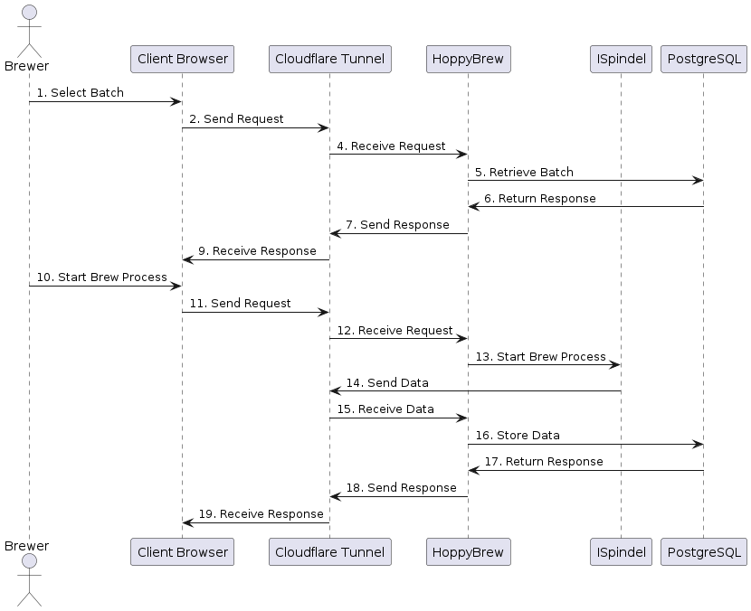

# Runtime View

User interactions with the system are depicted in the following sequence diagrams.

## CRUD Recipe

The sequence diagram illustrates CRUD operations for the Recipe entity, showcasing the standard pattern for all CRUD operations. It starts with the Brewer creating a new Recipe, which is then stored in the database. Subsequently, the Brewer can perform actions such as retrieving, updating, and deleting the Recipe as required. Additionally, there's an option to list all Recipes stored in the database.

The Brewer interacts with the system via the Client Browser, initiating communication with the Cloudflare Tunnel. This tunnel then communicates with the HoppyBrew application. Within the HoppyBrew application, communication with the PostgreSQL database takes place for storing and retrieving data.

<pre id="mycode" class="haskell numberLines" startFrom="100">
  <code>
@startuml 06-Runtime-View-CRUD-Recipe

actor Brewer as Brewer
participant "Client Browser" as ClientBrowser
entity "Cloudflare Tunnel" as CloudflareTunnel
boundary WebServer as "Web Server"
control AppServer as "Application Server\nHoppyBrew"
database "PostgreSQL" as PostgreSQL

Brewer -> ClientBrowser : 1. Create Recipe
ClientBrowser -> CloudflareTunnel : 2. Send Request
CloudflareTunnel -> AppServer : 3. Receive Request
AppServer -> PostgreSQL : 4. Store Recipe
PostgreSQL -> AppServer : 5. Return Response
AppServer -> CloudflareTunnel : 6. Send Response
CloudflareTunnel -> ClientBrowser : 7. Receive Response

Brewer -> ClientBrowser : 8. Retrieve Recipe
ClientBrowser -> CloudflareTunnel : 9. Send Request
CloudflareTunnel -> AppServer : 10. Receive Request
AppServer -> PostgreSQL : 11. Retrieve Recipe
PostgreSQL -> AppServer : 12. Return Response
AppServer -> CloudflareTunnel : 13. Send Response
CloudflareTunnel -> ClientBrowser : 14. Receive Response

Brewer -> ClientBrowser : 15. Update Recipe
ClientBrowser -> CloudflareTunnel : 16. Send Request
CloudflareTunnel -> AppServer : 17. Receive Request
AppServer -> PostgreSQL : 18. Update Recipe
PostgreSQL -> AppServer : 19. Return Response
AppServer -> CloudflareTunnel : 20. Send Response
CloudflareTunnel -> ClientBrowser : 21. Receive Response

Brewer -> ClientBrowser : 22. Delete Recipe
ClientBrowser -> CloudflareTunnel : 23. Send Request
CloudflareTunnel -> AppServer : 24. Receive Request
AppServer -> PostgreSQL : 25. Delete Recipe
PostgreSQL -> AppServer : 26. Return Response
AppServer -> CloudflareTunnel : 27. Send Response
CloudflareTunnel -> ClientBrowser : 28. Receive Response

Brewer -> ClientBrowser : 29. List Recipes
ClientBrowser -> CloudflareTunnel : 30. Send Request
CloudflareTunnel -> AppServer : 31. Receive Request
AppServer -> PostgreSQL : 32. Retrieve Recipes
PostgreSQL -> AppServer : 33. Return Response
AppServer -> CloudflareTunnel : 34. Send Response
CloudflareTunnel -> ClientBrowser : 35. Receive Response

@enduml
    </code>
</pre>

## CRUD Batch

A new Batch recipe is instantiated from an existing Recipe. The Brewer can then modify the Batch recipe as needed.

<pre id="mycode" class="haskell numberLines" startFrom="100">
  <code>
@startuml 07-Runtime-View-CRUD-Batch

actor Brewer as Brewer
participant "Client Browser" as ClientBrowser
participant "Cloudflare Tunnel" as CloudflareTunnel
participant "HoppyBrew" as HoppyBrew
database "PostgreSQL" as PostgreSQL

Brewer -> ClientBrowser : 1. List Recipes
ClientBrowser -> CloudflareTunnel : 2. Send Request
CloudflareTunnel -> HoppyBrew : 4. Receive Request
HoppyBrew -> PostgreSQL : 5. Retrieve Recipes
PostgreSQL -> HoppyBrew : 6. Return Response
HoppyBrew -> CloudflareTunnel : 7. Send Response
CloudflareTunnel -> ClientBrowser : 9. Receive Response

Brewer -> ClientBrowser : 10. Instantiate Batch from Recipe
ClientBrowser -> CloudflareTunnel : 11. Send Request
CloudflareTunnel -> HoppyBrew : 12. Receive Request
HoppyBrew -> PostgreSQL : 13. Retrieve Recipe
PostgreSQL -> HoppyBrew : 14. Return Response
HoppyBrew -> CloudflareTunnel : 15. Send Response
CloudflareTunnel -> ClientBrowser : 16. Receive Response

Brewer -> ClientBrowser : 17. Modify Batch
ClientBrowser -> CloudflareTunnel : 18. Send Request
CloudflareTunnel -> HoppyBrew : 19. Receive Request
HoppyBrew -> PostgreSQL : 20. Store Batch
PostgreSQL -> HoppyBrew : 21. Return Response
HoppyBrew -> CloudflareTunnel : 22. Send Response
CloudflareTunnel -> ClientBrowser : 23. Receive Response

@enduml
    </code>
</pre>

## Start Brew Process

The Brewer starts the brewing process by selecting a Batch recipe and starting the process. The ISpindel collects data from the brewing process and sends it to the system.

<pre id="mycode" class="haskell numberLines" startFrom="100">
  <code>
@startuml 08-Runtime-View-Start-Brew-Process

actor Brewer as Brewer
participant "Client Browser" as ClientBrowser
participant "Cloudflare Tunnel" as CloudflareTunnel
participant "HoppyBrew" as HoppyBrew
entity "ISpindel" as ISpindel

Brewer -> ClientBrowser : 1. Select Batch
ClientBrowser -> CloudflareTunnel : 2. Send Request
CloudflareTunnel -> HoppyBrew : 4. Receive Request
HoppyBrew -> PostgreSQL : 5. Retrieve Batch
PostgreSQL -> HoppyBrew : 6. Return Response
HoppyBrew -> CloudflareTunnel : 7. Send Response
CloudflareTunnel -> ClientBrowser : 9. Receive Response

Brewer -> ClientBrowser : 10. Start Brew Process
ClientBrowser -> CloudflareTunnel : 11. Send Request
CloudflareTunnel -> HoppyBrew : 12. Receive Request
HoppyBrew -> ISpindel : 13. Start Brew Process
ISpindel -> CloudflareTunnel : 14. Send Data
CloudflareTunnel -> HoppyBrew : 15. Receive Data
HoppyBrew -> PostgreSQL : 16. Store Data
PostgreSQL -> HoppyBrew : 17. Return Response
HoppyBrew -> CloudflareTunnel : 18. Send Response
CloudflareTunnel -> ClientBrowser : 19. Receive Response

@enduml
    </code>
</pre>

## \<Runtime Scenario 1\>

- *\<insert runtime diagram or textual description of the scenario\>*

- *\<insert description of the notable aspects of the interactions between the building block instances depicted in this diagram.\>*

## \<Runtime Scenario 2\>

## …

## \<Runtime Scenario n\>
