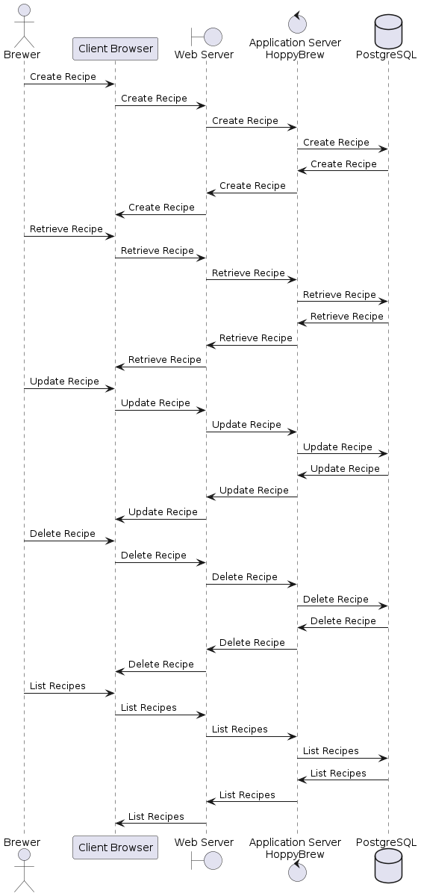

# Runtime View

User interactions with the system are depicted in the following sequence diagrams.

For the sake of simplicity, we will not include all possible interactions in the sequence diagrams. Instead, we will focus on the core interactions that are essential for understanding the system. And we will not include all components in the sequence diagrams such as cloudflare.

## CRUD Recipe

The sequence diagram illustrates CRUD operations for the Recipe entity, showcasing the standard pattern for all CRUD operations. It starts with the Brewer creating a new Recipe, which is then stored in the database. Subsequently, the Brewer can perform actions such as retrieving, updating, and deleting the Recipe as required. Additionally, there's an option to list all Recipes stored in the database.

The Brewer interacts with the system via the Client Browser, initiating communication with the Cloudflare Tunnel. This tunnel then communicates with the HoppyBrew application. Within the HoppyBrew application, communication with the PostgreSQL database takes place for storing and retrieving data.

<pre id="mycode" class="haskell numberLines" startFrom="100">
  <code>
@startuml 06-Runtime-View-CRUD-Recipe

actor Brewer as Brewer
participant "Client Browser" as ClientBrowser
boundary WebServer as "Web Server"
control AppServer as "Application Server\nHoppyBrew"
database "PostgreSQL" as PostgreSQL

Brewer -> ClientBrowser : Create Recipe
ClientBrowser -> WebServer : Create Recipe
WebServer -> AppServer : Create Recipe
AppServer -> PostgreSQL : Create Recipe
PostgreSQL -> AppServer : Create Recipe
AppServer -> WebServer : Create Recipe
WebServer -> ClientBrowser : Create Recipe

Brewer -> ClientBrowser : Retrieve Recipe
ClientBrowser -> WebServer : Retrieve Recipe
WebServer -> AppServer : Retrieve Recipe
AppServer -> PostgreSQL : Retrieve Recipe
PostgreSQL -> AppServer : Retrieve Recipe
AppServer -> WebServer : Retrieve Recipe
WebServer -> ClientBrowser : Retrieve Recipe

Brewer -> ClientBrowser : Update Recipe
ClientBrowser -> WebServer : Update Recipe
WebServer -> AppServer : Update Recipe
AppServer -> PostgreSQL : Update Recipe
PostgreSQL -> AppServer : Update Recipe
AppServer -> WebServer : Update Recipe
WebServer -> ClientBrowser : Update Recipe

Brewer -> ClientBrowser : Delete Recipe
ClientBrowser -> WebServer : Delete Recipe
WebServer -> AppServer : Delete Recipe
AppServer -> PostgreSQL : Delete Recipe
PostgreSQL -> AppServer : Delete Recipe
AppServer -> WebServer : Delete Recipe
WebServer -> ClientBrowser : Delete Recipe

Brewer -> ClientBrowser : List Recipes
ClientBrowser -> WebServer : List Recipes
WebServer -> AppServer : List Recipes
AppServer -> PostgreSQL : List Recipes
PostgreSQL -> AppServer : List Recipes
AppServer -> WebServer : List Recipes
WebServer -> ClientBrowser : List Recipes

@enduml
    </code>
</pre>

## CRUD Batch

As we already have covered the CRUD operations for the Recipe entity, the CRUD operations for the Batch entity follow a similar pattern and we will therefore not repeat the explanation here.

A new Batch is instantiated by the Brewer from an existing Recipe. The Brewer can then edit the Batch, instance without affecting the original Recipe. The Brewer can also delete the Batch if it is no longer needed. The Brewer can also list all Batches stored in the database.

A batch is intended to represent a single brewing process, which is why the batch can undergo Three core brewing stages, which then are followed by a variety of additional stages that are optional like conditioning, archiving, etc.

1. **Preparation:** The Brewer prepares the ingredients and equipment for the brewing process. This is basically just the initial instantiation of the Recipe as a Batch.
2. **Brewing:** The Brewer starts the brewing process. In this stage, the Brewer is provided with all key information about the Recipe, These are mainly a good overview of the recipe. A countdown timer to indicate when the next ingredient should be added, Required temperatures, PH levels, and other key information. The Brewer can also add notes to the batch.
3. **Fermentation:** The Brewer transfers the wort to the fermenter and adds the yeast. The Brewer can monitor the fermentation process, including the temperature, gravity, and other key metrics. The Brewer can also add notes to the batch. It is at this stage that the ISpindel comes into play, as it collects real-time data from the fermentation process and sends it to the system. The Brewer can monitor this data in real-time. The Brewer can also add notes to the batch.

<pre id="mycode" class="haskell numberLines" startFrom="100">
  <code>
@startuml 07-Runtime-View-CRUD-Batch

actor Brewer as Brewer
entity "ISpindel" as ISpindel
participant "Client Browser" as ClientBrowser
boundary WebServer as "Web Server"
control AppServer as "Application Server\nHoppyBrew"
database "PostgreSQL" as PostgreSQL

Brewer -> ClientBrowser : List Recipes
ClientBrowser -> WebServer : List Recipes
WebServer -> AppServer : List Recipes
AppServer -> PostgreSQL : List Recipes
PostgreSQL -> AppServer : List Recipes
AppServer -> WebServer : List Recipes
WebServer -> ClientBrowser : List Recipes

Brewer -> ClientBrowser : Instantiate Batch
ClientBrowser -> WebServer : Instantiate Batch
WebServer -> AppServer : Instantiate Batch
AppServer -> PostgreSQL : Instantiate Batch
PostgreSQL -> AppServer : Instantiate Batch
AppServer -> WebServer : Instantiate Batch
WebServer -> ClientBrowser : Instantiate Batch

Brewer -> ClientBrowser : Edit Batch
ClientBrowser -> WebServer : Edit Batch
WebServer -> AppServer : Edit Batch
AppServer -> PostgreSQL : Edit Batch
PostgreSQL -> AppServer : Edit Batch
AppServer -> WebServer : Edit Batch
WebServer -> ClientBrowser : Edit Batch

Brewer -> ClientBrowser : Start Brewing
ClientBrowser -> WebServer : Start Brewing
WebServer -> AppServer : Start Brewing
AppServer -> PostgreSQL : Start Brewing
PostgreSQL -> AppServer : Start Brewing
AppServer -> WebServer : Start Brewing
WebServer -> ClientBrowser : Start Brewing

Brewer -> ClientBrowser : Start Fermentation
ClientBrowser -> WebServer : Start Fermentation
WebServer -> AppServer : Start Fermentation
AppServer -> PostgreSQL : Start Fermentation
PostgreSQL -> AppServer : Start Fermentation
AppServer -> WebServer : Start Fermentation
WebServer -> ClientBrowser : Start Fermentation
ISpindel -> WebServer : Send Data
WebServer -> AppServer : Receive Data
AppServer -> PostgreSQL : Store Data
PostgreSQL -> AppServer : Confirm Data
AppServer -> WebServer : Confirm Data
WebServer -> ClientBrowser : Confirm Data

Brewer -> ClientBrowser : Add Notes
ClientBrowser -> WebServer : Add Notes
WebServer -> AppServer : Add Notes
AppServer -> PostgreSQL : Add Notes
PostgreSQL -> AppServer : Add Notes
AppServer -> WebServer : Add Notes
WebServer -> ClientBrowser : Add Notes

@enduml
    </code>
</pre>

## \<Runtime Scenario 1\>

- *\<insert runtime diagram or textual description of the scenario\>*

- *\<insert description of the notable aspects of the interactions between the building block instances depicted in this diagram.\>*

## \<Runtime Scenario 2\>

## …

## \<Runtime Scenario n\>
