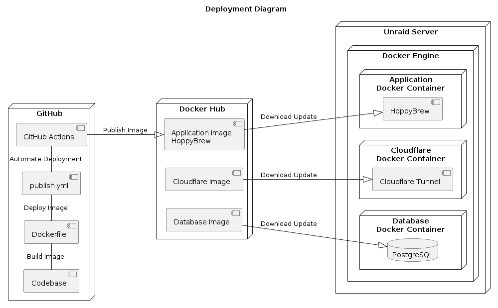

# Deployment View

Key words: Docker, Docker Compose, PostgreSQL, Github, publish.yml, Dockerfile, Github Actions, Continuous Integration, Continuous Deployment, CI/CD, Docker Hub.

The deployment view describes how the application is deployed and managed in a production environment. The application is deployed using Docker and Docker Compose, with PostgreSQL as the database technology. The codebase is stored in a central repository on GitHub, with a Dockerfile for building the application image and a publish.yml file for deploying the application. The deployment process is automated using GitHub Actions, which provides continuous integration and continuous deployment (CI/CD) for the application. The application image is stored in Docker Hub, which provides a registry for storing and managing container images.

TODO: Need to figure out how i automate update on the Unraid server when a new version is pushed to Docker Hub.

## Deployment Diagram

The deployment diagram provides a high-level overview of the deployment architecture of the application. It shows the different components of the application, including the client browser, the ISpindel, the Cloudflare service, the Unraid Server, and the PostgreSQL database. It also shows the communication paths between the components, including the HTTP requests and responses that are sent and received. The deployment diagram helps to visualize how the application is deployed and managed in a production environment, and how the different components interact with each other.

<pre id="mycode" class="haskell numberLines" startFrom="100">
  <code>
@startuml 08-Deployment-View
title Deployment Diagram

node "Unraid Server" {
    node "Docker Engine" {
        node "Cloudflare\nDocker Container" {
            component "Cloudflare Tunnel" as cloudflareTunnel
        }

        node "Application\nDocker Container" {
            component "HoppyBrew" as hoppybrew
        }

        node "Database\nDocker Container" {
            database "PostgreSQL" as postgres
        }
    }
}

@enduml
    </code>
</pre>

## Infrastructure Level 1

***\<Overview Diagram\>***

Motivation  
*\<explanation in text form\>*

Quality and/or Performance Features  
*\<explanation in text form\>*

Mapping of Building Blocks to Infrastructure  
*\<description of the mapping\>*

## Infrastructure Level 2

### *\<Infrastructure Element 1\>*

*\<diagram + explanation\>*

### *\<Infrastructure Element 2\>*

*\<diagram + explanation\>*

…

### *\<Infrastructure Element n\>*

*\<diagram + explanation\>*

\clearpage
