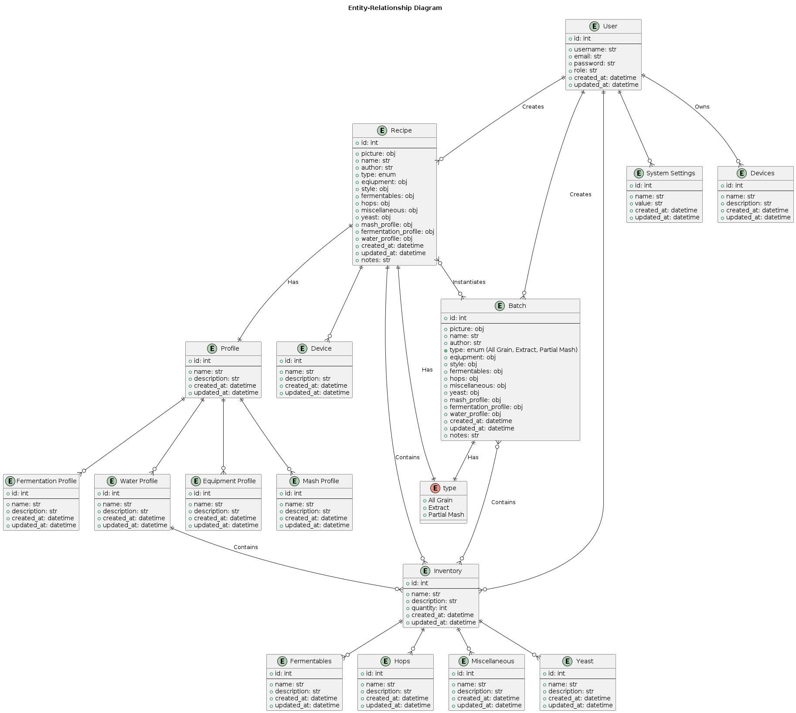

# Cross-cutting Concepts

HoppyBrew is a datacentric application, which is why everything revolves around the Entity-Relationship (ER-Diagram) model. The ER-Diagram model is a conceptual representation of the data in the application, showing the entities and their relationships. The ER-Diagram model helps to visualize the structure of the data and the relationships between the entities, which is essential for designing and implementing the database schema. The ER-Diagram model also helps to ensure the integrity and consistency of the data, as well as providing a clear and concise representation of the data model.

## Entity-Relationship Diagram

<pre id="mycode" class="haskell numberLines" startFrom="100">
  <code>
@startuml 09-ER-Diagram

entity "User" as user {
    + id: int
    --
    + username: str
    + email: str
    + password: str
    + role: str
    + created_at: datetime
    + updated_at: datetime
}

entity "Recipe" as recipe {
    + id: int
    --
    + name: str
    + description: str
    + style: str
    + abv: float
    + ibu: float
    + srm: float
    + og: float
    + fg: float
    + created_at: datetime
    + updated_at: datetime
}

entity "Batch" as batch {
    + id: int
    --
    + name: str
    + description: str
    + style: str
    + abv: float
    + ibu: float
    + srm: float
    + og: float
    + fg: float
    + created_at: datetime
    + updated_at: datetime
}

entity "Profile" as profile {
    + id: int
    --
    + name: str
    + description: str
    + created_at: datetime
    + updated_at: datetime
}

entity "Device" as device {
    + id: int
    --
    + name: str
    + description: str
    + created_at: datetime
    + updated_at: datetime
}

entity "Inventory" as inventory {
    + id: int
    --
    + name: str
    + description: str
    + quantity: int
    + created_at: datetime
    + updated_at: datetime
}

entity "System Settings" as systemSettings {
    + id: int
    --
    + name: str
    + value: str
    + created_at: datetime
    + updated_at: datetime
}

user ||--o{ recipe
recipe ||--o{ batch
user ||--o{ profile
user ||--o{ device
user ||--o{ inventory
user ||--o{ systemSettings

@enduml
    </code>
</pre>

\clearpage
