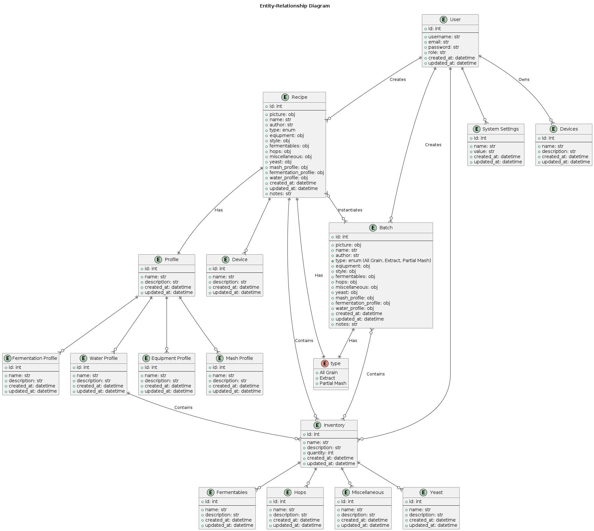

# Cross-cutting Concepts

HoppyBrew is a datacentric application, which is why everything revolves around the Entity-Relationship (ER-Diagram) model. The ER-Diagram model is a conceptual representation of the data in the application, showing the entities and their relationships. The ER-Diagram model helps to visualize the structure of the data and the relationships between the entities, which is essential for designing and implementing the database schema. The ER-Diagram model also helps to ensure the integrity and consistency of the data, as well as providing a clear and concise representation of the data model.

## Entity-Relationship Diagram

<pre id="mycode" class="haskell numberLines" startFrom="100">
  <code>
@startuml 09-ER-Diagram

title Entity-Relationship Diagram

entity "User" as user {
    + id: int
    --
    + username: str
    + email: str
    + password: str
    + role: str
    + created_at: datetime
    + updated_at: datetime
}

entity "Recipe" as recipe {
    + id: int
    --
    + picture: obj
    + name: str
    + author: str
    + type: enum
    + eqiupment: obj
    + style: obj
    + fermentables: obj
    + hops: obj
    + miscellaneous: obj
    + yeast: obj
    + mash_profile: obj
    + fermentation_profile: obj
    + water_profile: obj
    + created_at: datetime
    + updated_at: datetime
    + notes: str
}

enum "type" as type {
    + All Grain
    + Extract
    + Partial Mash
}

entity "Batch" as batch {
    + id: int
    --
    + picture: obj
    + name: str
    + author: str
    + type: enum (All Grain, Extract, Partial Mash)
    + eqiupment: obj
    + style: obj
    + fermentables: obj
    + hops: obj
    + miscellaneous: obj
    + yeast: obj
    + mash_profile: obj
    + fermentation_profile: obj
    + water_profile: obj
    + created_at: datetime
    + updated_at: datetime
    + notes: str
}

entity "Profile" as profile {
    + id: int
    --
    + name: str
    + description: str
    + created_at: datetime
    + updated_at: datetime
}

entity "Device" as device {
    + id: int
    --
    + name: str
    + description: str
    + created_at: datetime
    + updated_at: datetime
}

entity "Inventory" as inventory {
    + id: int
    --
    + name: str
    + description: str
    + quantity: int
    + created_at: datetime
    + updated_at: datetime
}

entity "System Settings" as systemSettings {
    + id: int
    --
    + name: str
    + value: str
    + created_at: datetime
    + updated_at: datetime
}

entity "Equipment Profile" as equipmentProfile {
    + id: int
    --
    + name: str
    + description: str
    + created_at: datetime
    + updated_at: datetime
}

entity "Mash Profile" as mashProfile {
    + id: int
    --
    + name: str
    + description: str
    + created_at: datetime
    + updated_at: datetime
}

entity "Fermentation Profile" as fermentationProfile {
    + id: int
    --
    + name: str
    + description: str
    + created_at: datetime
    + updated_at: datetime
}

entity "Water Profile" as waterProfile {
    + id: int
    --
    + name: str
    + description: str
    + created_at: datetime
    + updated_at: datetime
}

entity "Devices" as devices {
    + id: int
    --
    + name: str
    + description: str
    + created_at: datetime
    + updated_at: datetime
}

entity "Fermentables" as fermentables {
    + id: int
    --
    + name: str
    + description: str
    + created_at: datetime
    + updated_at: datetime
}

entity "Hops" as hops {
    + id: int
    --
    + name: str
    + description: str
    + created_at: datetime
    + updated_at: datetime
}

entity "Miscellaneous" as miscellaneous {
    + id: int
    --
    + name: str
    + description: str
    + created_at: datetime
    + updated_at: datetime
}

entity "Yeast" as yeast {
    + id: int
    --
    + name: str
    + description: str
    + created_at: datetime
    + updated_at: datetime
}

recipe ||--|| type : "Has"
batch ||--|| type : "Has"

user ||--o{ recipe : "Creates"
recipe }o--o{ batch : "Instantiates"
user ||--o{ batch : "Creates"
user ||--o{ devices : "Owns"
recipe ||--|| profile : "Has"
recipe ||--o{ device
user ||--o{ inventory
user ||--o{ systemSettings

profile ||--o{ equipmentProfile
profile ||--o{ mashProfile
profile ||--o{ fermentationProfile
profile ||--o{ waterProfile

inventory ||--o{ fermentables
inventory ||--o{ hops
inventory ||--o{ miscellaneous
inventory ||--o{ yeast

batch }o--o{ inventory : "Contains"

waterProfile ||--o{ inventory : "Contains"

recipe ||--o{ inventory : "Contains"

@enduml
    </code>
</pre>

\clearpage
